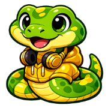

# About This Course

## Why Computer Science Matters Now More Than Ever

Computer science is one of the fastest-growing subjects in education worldwide. Here are some statistics that demonstrate its reach:

**In the United States (2026 projections):**

- Approximately **1.2 million high school students** take computer science courses each year[^1]
- Over **150,000 students** take the AP Computer Science A exam annually[^2]
- About **130,000 students** take the AP Computer Science Principles exam each year[^2]
- Only 57% of U.S. high schools offer a foundational computer science course, creating significant access disparities[^1]

**Worldwide:**

- An estimated **25 million students** study programming globally each year
- Computer science serves as a gateway to careers in software engineering, data science, artificial intelligence, cybersecurity, and many more fields

These numbers represent millions of students working to master the same concepts you'll learn in this course. You're joining a global community of learners building the computational thinking skills that power our digital world.

!!! mascot-welcome "Monty says: Let's code this!"
    { align=left width="80" }
    Did you know that traditional computer science textbooks at many US colleges and universities cost between **$150 and $250**?[^3] That's a lot of money to spend before you even write your first line of code! And here's the real kicker -- those expensive books don't even have interactive MicroSims to help you *see* what's happening.

    I believe every student deserves access to high-quality computer science education, regardless of their budget. That's why this entire textbook is **free and open source**, with dozens of interactive simulations that let you explore programming concepts hands-on. No paywalls, no access codes, no "edition 12 with slightly rearranged homework problems."

    Let me help you master computer science without breaking the bank. Together, we've got this!

## Learning Through Interactive Visualization

This course takes a fundamentally different approach to teaching computer science. Instead of staring at static code listings, you will build deep intuition through **interactive MicroSimulations**. These browser-based visualizations let you experiment with algorithms, data structures, control flow, and object-oriented concepts in real-time.

Watch a sorting algorithm rearrange elements step by step. See how recursion builds up a call stack and unwinds it. Explore how binary search narrows down a target in logarithmic time. Visualize how objects interact in a class hierarchy. These are not passive animations -- they are hands-on laboratories where you control the parameters and discover the concepts yourself.

## You Will Have Fun

Yes, you read that right. This course is designed to be genuinely enjoyable. The MicroSims turn abstract concepts into interactive playgrounds. The connections to real-world applications give every topic immediate relevance. And the satisfaction of writing a program that *works* is deeply rewarding.

Whether you aspire to build the next great app, develop artificial intelligence systems, create video games, analyze data to solve real-world problems, or simply want to understand the computational foundations of our increasingly digital world -- this course will give you the tools, the intuition, and the confidence to succeed.

Let's explore the beauty of computer science together!

## Background

The concepts covered by this book were generated by the following prompt:

!!! prompt
    What standard organizations describe the concepts that should be covered in a high-school AP Computer Science course using Python that would maximize the probability that the student would get college credits for taking the course?

Our tools have also matured since January 2025 when we first started using AI to generate textbooks. This version of our intelligent textbook was generated using Claude Code Skills in February 2026. We also put a strong focus on creating high-quality MicroSims that bring abstract concepts to life.

-- Dan McCreary, February 2026

## References

[^1]: Code.org. [2024 State of Computer Science Education](https://advocacy.code.org/stateofcs). Annual report on access and participation in K-12 computer science.

[^2]: College Board. [2025 AP Score Distributions](https://apstudents.collegeboard.org/about-ap-scores/score-distributions). AP Students.

[^3]: OpenStax. [About OpenStax](https://openstax.org/about). Notes that the average student spends approximately $1,200 per year on textbooks.
