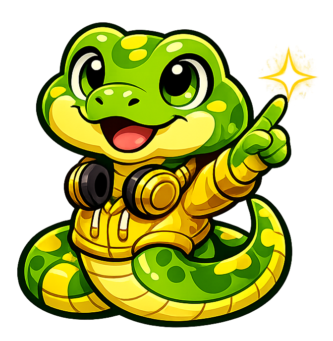

# Introduction to Computer Science

## Summary

This chapter introduces the foundational concepts of computer science that form the basis for all programming work. Students will learn about computational thinking, including decomposition, pattern recognition, and abstraction. The chapter also covers hardware basics, binary number systems, character encoding, and provides an overview of programming languages with a focus on how Python fits into the landscape.

## Concepts Covered

This chapter covers the following 20 concepts from the learning graph:

1. Computer Science
2. Computational Thinking
3. Algorithms
4. Abstraction
5. Decomposition
6. Pattern Recognition
7. Stepwise Refinement
8. Problem Solving
9. Binary Number System
10. Bits and Bytes
11. Character Encoding
12. ASCII and Unicode
13. Computer Hardware
14. CPU and Memory
15. Input and Output Devices
16. Operating Systems
17. Programming Languages
18. Compiled vs Interpreted
19. Python Language
20. Python Interpreter

## Prerequisites

This chapter assumes only the prerequisites listed in the [course description](../../course-description.md). No prior programming experience is required.

---

!!! mascot-welcome "Monty says: Let's code this!"
    { align=left width="80" }
    Welcome, coders! You're about to take your first step into the world of computer science. Don't worry if everything feels brand new — that's exactly where you're supposed to be. By the end of this chapter, you'll understand how computers think, how they store information, and why Python is a fantastic language to learn first. Let's do this!

## What Is Computer Science?

You might think **computer science** is all about typing code on a screen. That's definitely *part* of it, but it's a lot bigger than that. Computer science is the study of how to solve problems using computation. It's about figuring out the right steps to take, organizing information, and getting a machine to do the heavy lifting for you.

Think of it this way: a chef follows a recipe, a pilot follows a flight plan, and a computer follows *instructions that you write*. Computer science is the art and science of writing those instructions — and writing them well.

Computer science shows up in places you might not expect:

- **Medicine:** Analyzing medical images to detect diseases
- **Music:** Generating playlists based on your listening habits
- **Sports:** Tracking player stats and predicting game outcomes
- **Gaming:** Building the virtual worlds you explore on your console
- **Climate science:** Modeling weather patterns and forecasting storms

No matter what career path interests you, computer science skills will give you a superpower: the ability to automate repetitive tasks, analyze massive amounts of data, and build tools that help people.

## Computational Thinking

Before you can tell a computer what to do, you need to think like one — sort of. **Computational thinking** is a problem-solving approach that breaks big, messy problems into smaller, manageable pieces. It's not just for computers. You use computational thinking every day without realizing it.

Imagine you're planning a birthday party. You don't just think "have a party" and hope for the best. You break it down: choose a date, pick a venue, make a guest list, plan food, set up decorations. That process of breaking a big task into smaller steps? That's computational thinking in action.

Computational thinking has four main pillars:

| Pillar | What It Means | Party Example |
|--------|--------------|---------------|
| **Decomposition** | Break a big problem into smaller parts | "Plan food" becomes: choose menu, buy ingredients, cook, set up the table |
| **Pattern Recognition** | Spot similarities and repeating patterns | "Last year we ran out of pizza — let's order more this time" |
| **Abstraction** | Focus on what matters, ignore what doesn't | "I don't need to know the exact cheese brand — I just need 'pizza for 20'" |
| **Algorithms** | Create step-by-step instructions | "First set up tables, then put out plates, then bring out food" |

Let's look at each of these more closely.

### Decomposition

**Decomposition** means taking a complex problem and splitting it into smaller, easier-to-solve pieces. It's like eating a pizza — you don't try to shove the whole thing in your mouth at once (please don't). You cut it into slices.

In computer science, we decompose problems all the time. Building a video game? That decomposes into: drawing graphics, handling player input, tracking scores, playing sound effects, and managing game levels. Each of those pieces can be worked on separately, and when you put them all together, you've got a working game.

### Pattern Recognition

**Pattern recognition** is about spotting things that repeat or look similar. Once you see a pattern, you can reuse a solution instead of starting from scratch.

Think about your morning routine. You probably do roughly the same things every school day: wake up, get dressed, eat breakfast, grab your backpack. That's a pattern. If someone asked you to plan your morning for next Tuesday, you wouldn't have to invent a whole new routine — you'd follow the pattern.

In computing, patterns are everywhere. If you're building an app that displays a list of songs, a list of contacts, and a list of homework assignments, you might notice that "display a list of items" is a repeating pattern. Write the solution once, and reuse it.

!!! mascot-thinking "Monty says: You've got this!"
    { align=left width="80" }
    Here's a fun pattern to spot: every chapter in this book starts with simple ideas and builds to more complex ones. Once you notice that pattern, you'll know what to expect — and you can plan your study time accordingly!

### Abstraction

**Abstraction** means stripping away the details you don't need so you can focus on what really matters. A map is a perfect example. A real city has millions of details — trees, fire hydrants, stray cats. But a subway map only shows you the train lines and stops. It *abstracts away* everything else so you can figure out how to get from point A to point B.

In computer science, abstraction lets you work at different levels. When you're driving a car, you don't need to understand how every piston fires in the engine. You just need the steering wheel, pedals, and gear shift. The car's designers *abstracted* the engine complexity behind a simple interface.

### Algorithms

An **algorithm** is a step-by-step set of instructions for solving a problem. You follow algorithms all the time:

- A recipe for baking cookies is an algorithm
- Directions from your house to school are an algorithm
- The steps for solving a math equation are an algorithm

What makes a good algorithm? It needs to be:

1. **Clear** — Each step is unambiguous
2. **Ordered** — The steps happen in a specific sequence
3. **Finite** — It eventually stops (no infinite loops of cookie baking, as tempting as that sounds)
4. **Effective** — Each step can actually be carried out

Here's a simple algorithm for making a peanut butter and jelly sandwich:

1. Get two slices of bread
2. Open the peanut butter jar
3. Spread peanut butter on one slice
4. Open the jelly jar
5. Spread jelly on the other slice
6. Press the two slices together
7. Enjoy!

Seems obvious, right? But try telling a computer to "make a sandwich" without those steps, and you'll get nowhere. Computers are *incredibly* literal — they do exactly what you tell them, nothing more, nothing less.

#### Diagram: Computational Thinking Pillars

<iframe src="../../sims/computational-thinking-pillars/main.html" width="100%" height="500px" scrolling="no"></iframe>

Computational Thinking Pillars Interactive Infographic

Type: infographic
**sim-id:** computational-thinking-pillars 
**Library:** p5.js 
**Status:** Specified

**Bloom Level:** Understand (L2)
**Bloom Verb:** classify, explain

**Learning Objective:** Students will be able to identify and explain the four pillars of computational thinking (decomposition, pattern recognition, abstraction, algorithms) and describe how they work together to solve problems.

**Purpose:** Present the four pillars of computational thinking as an interactive concept map where students can hover over each pillar to see its definition, a real-world analogy, and a computing example.

**Layout:**
- Central node labeled "Computational Thinking" in the middle of the canvas
- Four surrounding nodes for each pillar, arranged in a diamond pattern
- Connecting lines from center to each pillar

**Nodes:**

1. Center: "Computational Thinking" (green, larger)
2. Top: "Decomposition" (blue)
   - Hover text: "Break big problems into smaller parts. Like cutting a pizza into slices before eating it."
   - Computing example: "Building a game = graphics + input + scoring + sound"
3. Right: "Pattern Recognition" (orange)
   - Hover text: "Spot repeating similarities. Like noticing your morning routine is the same each day."
   - Computing example: "Reusing 'display a list' code for songs, contacts, and tasks"
4. Bottom: "Abstraction" (purple)
   - Hover text: "Focus on what matters, ignore what doesn't. Like a subway map hiding city details."
   - Computing example: "Using a function without knowing how it works inside"
5. Left: "Algorithms" (red)
   - Hover text: "Step-by-step instructions to solve a problem. Like a recipe for cookies."
   - Computing example: "The exact steps to sort a list of numbers from smallest to largest"

**Interactive elements:**
- Hover over any pillar node to display a tooltip with definition, analogy, and computing example
- Click a pillar node to highlight it and show a brief animation connecting it to the center
- All four pillars pulse gently to invite interaction

**Visual style:** Clean, modern with rounded rectangles for nodes, soft connecting lines
**Color scheme:** Each pillar gets a distinct color; center node is green
**Responsive:** Canvas resizes with window; nodes reposition proportionally

**Instructional Rationale:** Hover-to-reveal interaction supports the Understand level by letting students explore each pillar at their own pace and connect definitions to concrete examples. The spatial layout reinforces that these four pillars work together as parts of a unified approach.

### Stepwise Refinement

**Stepwise refinement** takes decomposition one level deeper. Once you've broken a problem into parts, you break each part into even *smaller* parts until every piece is simple enough to solve directly.

Think of it like zooming in on a map. First you see the whole country. Then you zoom into your state. Then your city. Then your neighborhood. Then your street. Each zoom gives you more detail.

For example, "plan food for the party" might refine into:

1. Decide on pizza
2. Count the guests (20 people)
3. Estimate 3 slices per person (60 slices total)
4. Each pizza has 8 slices, so order 8 pizzas
5. Call the pizza place and place the order

Each step is concrete and doable. That's the power of stepwise refinement — it turns a vague idea into a clear action plan.

### Problem Solving

All of these techniques — decomposition, pattern recognition, abstraction, algorithms, and stepwise refinement — come together under the umbrella of **problem solving**. In computer science, problem solving isn't about guessing or being lucky. It's a *systematic* process:

1. **Understand** the problem — What are you trying to do?
2. **Plan** your approach — Which techniques will you use?
3. **Execute** your plan — Write out the steps (or eventually, write code)
4. **Review** your solution — Does it actually work? Can you improve it?

This four-step process works whether you're planning a party, solving a math problem, or writing a computer program. You'll use it throughout this entire course.

## How Computers Work: Hardware Basics

Now that you know *how* to think about problems, let's look at the machine that will actually solve them for you. Time to peek under the hood.

### Computer Hardware

**Computer hardware** is the physical stuff you can touch: the keyboard you type on, the screen you're reading right now, the chips inside the case. Hardware is the body of the computer — without it, software has nowhere to live.

Every computer, from a massive server in a data center to the phone in your pocket, has the same basic components:

| Component | What It Does | Everyday Analogy |
|-----------|-------------|------------------|
| **CPU** | Processes instructions | The brain |
| **Memory (RAM)** | Stores data temporarily while working | A desk where you spread out papers |
| **Storage** (SSD/HDD) | Stores data permanently | A filing cabinet |
| **Input devices** | Send information to the computer | Your ears and eyes |
| **Output devices** | Display results from the computer | Your mouth and hands |

### CPU and Memory

The **CPU** (Central Processing Unit) is the brain of the computer. It's a tiny chip — smaller than a postage stamp — but it can perform *billions* of calculations every second. When you hear someone talk about a "fast computer," they're usually talking about the CPU.

The CPU doesn't work alone, though. It needs **memory** (also called **RAM**, or Random Access Memory) to hold the data it's currently working with. Think of RAM like your desk. When you're doing homework, you spread your textbook, notebook, and calculator on the desk for easy access. When you're done, you put everything back in your backpack (that's storage). RAM is fast but temporary — when you turn off the computer, everything in RAM disappears.

Why not just use storage for everything? Because storage (your hard drive or SSD) is *much* slower than RAM. It's the difference between grabbing a book off your desk versus walking to the library to check it out.

### Input and Output Devices

**Input devices** let you send information *into* the computer:

- Keyboard (typing text)
- Mouse or trackpad (pointing and clicking)
- Microphone (voice input)
- Camera (photos and video)
- Touchscreen (tapping and swiping)

**Output devices** let the computer send information *back to you*:

- Monitor/screen (visual display)
- Speakers (audio)
- Printer (paper output)

Some devices do both! A touchscreen is both input (you tap it) and output (it shows you images). Pretty clever.

#### Diagram: Inside a Computer

<iframe src="../../sims/inside-a-computer/main.html" width="100%" height="500px" scrolling="no"></iframe>

Inside a Computer Interactive Diagram

Type: diagram
**sim-id:** inside-a-computer 
**Library:** p5.js 
**Status:** Specified

**Bloom Level:** Remember (L1)
**Bloom Verb:** identify, label

**Learning Objective:** Students will be able to identify the main hardware components of a computer (CPU, RAM, storage, input devices, output devices) and describe the role of each.

**Purpose:** Interactive block diagram showing the major components inside a computer and how data flows between them.

**Layout:**
- Center: CPU chip (large, prominent)
- Connected above: RAM (memory sticks)
- Connected below: Storage (SSD/HDD icon)
- Left side: Input devices group (keyboard, mouse, microphone icons)
- Right side: Output devices group (monitor, speaker, printer icons)
- Arrows showing data flow direction between components

**Interactive elements:**
- Hover over any component to see its name, description, and everyday analogy
- Click a component to highlight all data flow arrows connected to it
- A "Show Data Flow" button animates colored dots traveling along the arrows to show how information moves: input → CPU → RAM ↔ Storage → output

**Hover text content:**
- CPU: "The brain — processes billions of instructions per second"
- RAM: "The desk — fast, temporary workspace for active tasks"
- Storage: "The filing cabinet — permanent storage that survives power off"
- Input devices: "How you talk to the computer — keyboard, mouse, mic"
- Output devices: "How the computer talks back — screen, speakers, printer"

**Color scheme:**
- CPU: gold/yellow
- RAM: blue
- Storage: green
- Input devices: light purple
- Output devices: orange
- Data flow arrows: gray, animated dots in red

**Visual style:** Clean icons with rounded rectangles, soft shadows
**Responsive:** Reposition components on window resize; maintain proportional spacing

**Instructional Rationale:** Label-and-identify interaction supports the Remember level. Hover-to-reveal definitions help students associate component names with functions. The animated data flow builds a mental model of how parts work together.

### Operating Systems

With all these hardware components, something needs to coordinate them — like a traffic cop directing cars at a busy intersection. That's the job of the **operating system** (OS).

The operating system is software that manages your computer's hardware and provides a platform for other programs to run. When you click an icon to open an app, the OS loads it into memory. When you save a file, the OS writes it to storage. When you press a key, the OS figures out which program should receive that input.

Popular operating systems include:

- **Windows** — The most common OS for PCs
- **macOS** — Apple's operating system for Mac computers
- **Linux** — A free, open-source OS popular with developers and servers
- **ChromeOS** — Google's lightweight OS for Chromebooks
- **Android** and **iOS** — Mobile operating systems for phones and tablets

You don't need to know the details of how an operating system works for this course. Just know that it's the invisible layer between you and the hardware, making everything run smoothly.

## Speaking in Ones and Zeros: Binary and Data

Here's something that might blow your mind: deep down, your computer only understands two things — **1** and **0**. That's it. Every photo you've ever taken, every song you've streamed, every text message you've sent — all of it boils down to enormous sequences of ones and zeros.

### The Binary Number System

Humans use the **decimal system** (base 10), which has ten digits: 0 through 9. We probably use base 10 because we have ten fingers. (Thanks, evolution!)

Computers use the **binary number system** (base 2), which has only two digits: **0** and **1**. Why? Because electronic circuits have two natural states: *on* (electricity flowing) and *off* (no electricity). It's like a light switch — it's either up or down, on or off, 1 or 0.

Here's how binary counting compares to decimal:

| Decimal | Binary | How to Read It |
|---------|--------|---------------|
| 0 | 0000 | Zero |
| 1 | 0001 | One |
| 2 | 0010 | Two |
| 3 | 0011 | Three |
| 4 | 0100 | Four |
| 5 | 0101 | Five |
| 6 | 0110 | Six |
| 7 | 0111 | Seven |
| 8 | 1000 | Eight |

Notice the pattern? Each position in a binary number represents a power of 2 (just like each position in a decimal number represents a power of 10). The rightmost digit is the 1s place, then the 2s place, then the 4s place, then the 8s place, and so on.

So binary `0110` means: (0 x 8) + (1 x 4) + (1 x 2) + (0 x 1) = **6**

### Bits and Bytes

A single binary digit (a 0 or a 1) is called a **bit**. It's the smallest unit of data a computer can handle. One bit alone isn't very useful — it can only represent two values.

But group bits together, and things get interesting. A group of **8 bits** is called a **byte**. One byte can represent \(2^8 = 256\) different values (0 through 255). That's enough to store a single letter, a small number, or a color value.

Here's how data sizes scale up:

| Unit | Size | What It Can Hold |
|------|------|-----------------|
| 1 Bit | 1 or 0 | A single yes/no answer |
| 1 Byte | 8 bits | One character (like the letter 'A') |
| 1 Kilobyte (KB) | ~1,000 bytes | A short email |
| 1 Megabyte (MB) | ~1,000 KB | A high-quality photo |
| 1 Gigabyte (GB) | ~1,000 MB | About 250 songs |
| 1 Terabyte (TB) | ~1,000 GB | About 500 hours of video |

!!! mascot-tip "Monty says: Let's debug this together!"
    { align=left width="80" }
    Here's a handy trick: to figure out how many values N bits can represent, just calculate 2 raised to the power of N. So 8 bits = 256 values, 16 bits = 65,536 values, and 32 bits = over 4 billion values. Bits add up fast!

#### Diagram: Binary Number Explorer

<iframe src="../../sims/binary-number-explorer/main.html" width="100%" height="450px" scrolling="no"></iframe>

Binary Number Explorer MicroSim

Type: microsim
**sim-id:** binary-number-explorer 
**Library:** p5.js 
**Status:** Specified

**Bloom Level:** Apply (L3)
**Bloom Verb:** calculate, demonstrate

**Learning Objective:** Students will be able to convert between binary and decimal representations by toggling individual bits and observing the resulting decimal value.

**Purpose:** An interactive binary-to-decimal converter that lets students click individual bits to toggle them on/off and immediately see the decimal equivalent update.

**Canvas layout:**
- Top section: Title "Binary Number Explorer"
- Middle section: 8 large toggle switches representing 8 bits, arranged left to right from most significant bit (128) to least significant bit (1)
- Above each switch: The place value label (128, 64, 32, 16, 8, 4, 2, 1)
- Below the switches: The current binary string (e.g., "01000001")
- Bottom section: Large display showing the decimal equivalent (e.g., "= 65")
- Below that: The calculation breakdown (e.g., "0×128 + 1×64 + 0×32 + 0×16 + 0×8 + 0×4 + 0×2 + 1×1 = 65")

**Interactive controls:**
- Click any bit to toggle it between 0 (off/gray) and 1 (on/green)
- "Random" button: Sets a random binary number for the student to interpret
- "Reset" button: Sets all bits to 0
- "Challenge Mode" button: Shows a target decimal number and asks the student to set the correct binary bits

**Visual elements:**
- Each bit displayed as a large toggle switch or clickable circle
- ON bits glow green with "1" label
- OFF bits are gray with "0" label
- Place values shown above in a lighter font
- Calculation breakdown updates in real-time
- In Challenge Mode, a target number appears and turns green when matched correctly

**Default state:** All bits set to 0 (decimal 0)

**Behavior:**
- Toggling any bit immediately recalculates and displays the decimal value
- The calculation breakdown updates to show which place values are active
- In Challenge Mode, display a congratulations message when the student matches the target number

**Responsive:** Canvas width adjusts to window; bit switches scale proportionally

**Instructional Rationale:** Direct manipulation of individual bits supports the Apply level by requiring students to actively calculate binary-to-decimal conversions. Immediate visual feedback on each toggle helps build fluency with place values. Challenge Mode adds a goal-oriented practice dimension.

### Character Encoding

So computers store everything as numbers. But how do they handle *text*? After all, you're reading words right now, not numbers. The answer is **character encoding** — a system that assigns a unique number to every letter, digit, and symbol.

Think of it like a secret code book. The letter 'A' might be assigned the number 65. The letter 'B' gets 66. A space is 32. When you type "Hi!" on your keyboard, the computer actually stores the numbers 72, 105, 33.

### ASCII and Unicode

The first widely used character encoding was **ASCII** (American Standard Code for Information Interchange), created in the 1960s. ASCII uses 7 bits to represent 128 characters, including:

- Uppercase letters (A-Z): numbers 65-90
- Lowercase letters (a-z): numbers 97-122
- Digits (0-9): numbers 48-57
- Punctuation and special characters: !, @, #, etc.
- Control characters: things like "new line" and "tab"

ASCII worked great for English, but what about other languages? Chinese has thousands of characters. Arabic reads right to left. Japanese uses multiple writing systems. ASCII couldn't handle any of that.

Enter **Unicode**, the modern standard that assigns a unique number to over 150,000 characters from virtually every writing system on Earth — plus emoji! That smiley face you send in texts (😊) has a Unicode number just like the letter 'A' does.

Here are some examples:

| Character | ASCII Value | Unicode Name |
|-----------|------------|--------------|
| A | 65 | Latin Capital Letter A |
| a | 97 | Latin Small Letter A |
| 0 | 48 | Digit Zero |
| ! | 33 | Exclamation Mark |
| — | N/A | Em Dash (Unicode only) |
| 😊 | N/A | Smiling Face with Smiling Eyes (Unicode only) |

The most common Unicode encoding is called **UTF-8**. It's cleverly designed to be backward compatible with ASCII — so all the old ASCII characters still work — while also supporting the full range of Unicode characters. Most websites and modern software use UTF-8.

#### Diagram: ASCII Character Map

<iframe src="../../sims/ascii-character-map/main.html" width="100%" height="500px" scrolling="no"></iframe>

ASCII Character Map Interactive Explorer

Type: infographic
**sim-id:** ascii-character-map 
**Library:** p5.js 
**Status:** Specified

**Bloom Level:** Remember (L1)
**Bloom Verb:** identify, recall

**Learning Objective:** Students will be able to look up the ASCII numeric value for common characters and recognize the pattern of how letters and digits are organized in the ASCII table.

**Purpose:** An interactive grid showing the printable ASCII characters (codes 32-126) where students can hover over any character to see its decimal value, binary representation, and category.

**Layout:**
- Grid of cells, approximately 16 columns x 6 rows, showing printable ASCII characters
- Each cell displays the character in a large font
- Color-coded by category: uppercase letters (blue), lowercase letters (green), digits (orange), punctuation/symbols (purple), space (gray)

**Interactive elements:**
- Hover over any cell to see a tooltip showing:
  - The character
  - Decimal ASCII value
  - Binary representation (8-bit)
  - Category (letter, digit, symbol)
- A search box at the top: type a character to highlight it in the grid
- A "Show Decimal Values" toggle: when on, each cell shows the number below the character

**Color scheme:**
- Uppercase A-Z: light blue background
- Lowercase a-z: light green background
- Digits 0-9: light orange background
- Symbols/punctuation: light purple background
- Space: light gray

**Visual style:** Clean grid with rounded cell borders, soft shadows on hover
**Responsive:** Grid adjusts column count based on window width

**Instructional Rationale:** A visual grid layout supports the Remember level by letting students browse and locate characters spatially. Color-coding by category reveals the organizational structure of ASCII. The hover-to-reveal interaction encourages active exploration rather than passive reading of a table.

## Programming Languages: Talking to Computers

You now know that computers only understand binary — ones and zeros. But no one wants to write programs as long strings of 1s and 0s. (Trust me, people tried in the early days. It was not fun.) That's why we have **programming languages**.

A **programming language** is a structured way to write instructions that a computer can understand. It sits somewhere between human language (which is flexible and messy) and machine language (which is rigid and binary). Programming languages let you express ideas like "add these two numbers" or "repeat this action 100 times" in a way that's readable by both you *and* the computer.

There are hundreds of programming languages, each designed for different purposes:

| Language | Common Use | Fun Fact |
|----------|-----------|----------|
| Python | General purpose, AI, data science | Named after Monty Python, not the snake! |
| JavaScript | Web development | Runs in every web browser on Earth |
| Java | Enterprise software, Android apps | "Write once, run anywhere" |
| C | Operating systems, embedded systems | Created in 1972 and still going strong |
| Scratch | Learning to code (visual blocks) | Developed at MIT for beginners |
| Swift | iPhone and Mac apps | Apple's modern replacement for Objective-C |

### Compiled vs. Interpreted

Programming languages generally fall into two categories based on how they turn your code into something the computer can run:

**Compiled languages** (like C and Java) use a special program called a **compiler** to translate your entire source code into machine code *before* the program runs. It's like translating a whole book from English to Spanish before giving it to a Spanish reader. The translation takes time, but once it's done, the Spanish reader can read it very quickly.

**Interpreted languages** (like Python and JavaScript) use an **interpreter** that translates and runs your code *one line at a time*. It's like having a live translator at a conference — they translate each sentence as the speaker says it. This is more flexible (you can change things on the fly), but it can be a bit slower since the translation happens while the program is running.

Here's a quick comparison:

| Feature | Compiled | Interpreted |
|---------|----------|-------------|
| Translation | All at once, before running | Line by line, while running |
| Speed | Generally faster execution | Generally slower execution |
| Flexibility | Must recompile after changes | Changes take effect immediately |
| Error detection | Catches many errors before running | Errors found when that line runs |
| Examples | C, C++, Go, Rust | Python, JavaScript, Ruby |

!!! mascot-thinking "Monty says: Let's debug this together!"
    { align=left width="80" }
    Here's an analogy that might stick: A compiled language is like baking a whole cake before serving it. An interpreted language is like making pancakes — you cook and serve them one at a time. Both give you something delicious, just in different ways!

## Why Python?

Out of all those programming languages, why are we learning **Python**? Great question. Here's why Python is an excellent first language:

- **Readable:** Python code looks almost like English. When you read a Python program, you can often guess what it does even if you've never coded before.
- **Beginner-friendly:** Python has a gentler learning curve than most languages. Less punctuation, less boilerplate, fewer things to memorize.
- **Powerful:** Despite being easy to learn, Python is used by professionals at Google, NASA, Netflix, Instagram, and countless other organizations.
- **Versatile:** Python is used for web development, data analysis, artificial intelligence, scientific computing, automation, and much more.
- **Huge community:** Millions of Python developers worldwide means tons of tutorials, libraries, and help when you get stuck.

Python was created in 1991 by Guido van Rossum, who named it after the British comedy group *Monty Python's Flying Circus* (not the snake — though snakes have become the unofficial mascot). Van Rossum wanted a language that was fun to use, and he succeeded.

### The Python Interpreter

Since Python is an interpreted language, it uses the **Python interpreter** to run your code. The interpreter reads your Python instructions, translates them into something the computer understands, and executes them.

You can think of the Python interpreter as a very obedient (but very literal) assistant. It will do exactly what you ask — no more, no less. If you give it perfect instructions, it will produce perfect results. If your instructions have a mistake, it will tell you (sometimes cryptically, but it tries).

The interpreter can work in two modes:

1. **Interactive mode** — You type one command at a time, and the interpreter responds immediately. Great for experimenting and testing ideas quickly.
2. **Script mode** — You write all your commands in a file (a "script"), and the interpreter runs the whole file from top to bottom. This is how real programs are built.

We'll explore both modes hands-on in the next chapter when we start writing actual Python code.

#### Diagram: Compiled vs. Interpreted Languages

<iframe src="../../sims/compiled-vs-interpreted/main.html" width="100%" height="500px" scrolling="no"></iframe>

Compiled vs Interpreted Languages Comparison MicroSim

Type: microsim
**sim-id:** compiled-vs-interpreted 
**Library:** p5.js 
**Status:** Specified

**Bloom Level:** Understand (L2)
**Bloom Verb:** compare, explain

**Learning Objective:** Students will be able to compare compiled and interpreted language execution models by stepping through a visual side-by-side demonstration of how source code is translated and run.

**Purpose:** A side-by-side animated comparison showing how compiled and interpreted languages process the same simple program, making the abstract concept of compilation vs interpretation concrete and visible.

**Canvas layout:**
- Split screen: left half labeled "Compiled (e.g., C)", right half labeled "Interpreted (e.g., Python)"
- Each side shows a 3-stage pipeline:
  - Stage 1: Source code (a simple 3-line pseudocode program)
  - Stage 2: Translation step (compiler on left, interpreter on right)
  - Stage 3: Execution/output

**Data Visibility Requirements:**
- Stage 1: Show identical source code on both sides:
  - Line 1: "x = 5"
  - Line 2: "y = 10"
  - Line 3: "print x + y"
- Stage 2 (Compiled): Show ALL lines being translated at once into machine code, then a "Ready to run" indicator
- Stage 2 (Interpreted): Show ONLY the current line being translated, with a "Translating line N..." indicator
- Stage 3 (Compiled): After full translation, show rapid execution of all lines, output appears: "15"
- Stage 3 (Interpreted): After each line is translated, it immediately executes before moving to the next line. Output "15" appears after the last line.

**Interactive controls:**
- "Step" button: Advance the demonstration one step at a time
- "Auto Play" button: Animate all steps automatically with a 1-second delay
- "Reset" button: Return to the starting state
- Speed slider: Adjust auto-play speed (0.5s to 2s per step)

**Visual elements:**
- Source code lines highlighted in yellow when being processed
- Compiled side: all lines glow simultaneously during compilation
- Interpreted side: one line glows at a time
- Arrow animations show flow from source → translation → execution
- A step counter shows "Step N of M" in the footer

**Instructional Rationale:** Step-through with worked examples is appropriate because the Understand/compare objective requires learners to observe the different sequencing of translation and execution. Side-by-side layout makes the structural difference immediately visible. Step controls let students pause and reflect at each stage rather than watching a continuous animation.

## Putting It All Together

Let's step back and see how everything in this chapter connects. You've learned that:

1. **Computer science** is about solving problems with computation
2. **Computational thinking** gives you a toolkit: decomposition, pattern recognition, abstraction, and algorithms
3. **Hardware** provides the physical machinery: CPU, memory, storage, and I/O devices
4. **Binary** is the language computers actually speak (ones and zeros)
5. **Character encoding** (ASCII and Unicode) maps human-readable text to binary numbers
6. **Programming languages** let you write instructions in a human-friendly way
7. **Python** is a beginner-friendly, powerful, interpreted language — and it's what we'll use throughout this course

These concepts build on each other like floors of a building. Hardware is the foundation. Binary is how data is stored in that hardware. Character encoding turns human text into binary. Programming languages let you write instructions without worrying about binary. And computational thinking helps you write *good* instructions.

!!! mascot-celebration "Monty says: You've got this!"
    { align=left width="80" }
    You just finished your first chapter — nice work, coder! You now know more about how computers think and work than most people ever learn. In the next chapter, we'll get our hands dirty with actual Python code. Get ready to write your first program!

## Key Takeaways

- **Computer science** is the study of solving problems using computation — it shows up in every field from medicine to music.
- **Computational thinking** has four pillars: decomposition, pattern recognition, abstraction, and algorithms.
- **Stepwise refinement** means breaking problems down again and again until each piece is simple.
- **Computer hardware** includes the CPU (brain), RAM (desk), storage (filing cabinet), and input/output devices.
- **Binary** uses only 1s and 0s. A bit is a single binary digit; a byte is 8 bits.
- **ASCII** encodes 128 characters; **Unicode** encodes 150,000+ characters from every writing system (including emoji!).
- **Operating systems** manage hardware and run your programs.
- **Programming languages** let you write instructions the computer can follow. They can be compiled (all-at-once translation) or interpreted (line-by-line translation).
- **Python** is an interpreted, readable, versatile language — and it's your new best friend for this course.

??? question "Check Your Understanding: What binary number equals decimal 13?"
    Binary **1101** = (1 × 8) + (1 × 4) + (0 × 2) + (1 × 1) = 8 + 4 + 0 + 1 = **13**

??? question "Check Your Understanding: Which pillar of computational thinking means 'focus on what matters and ignore details'?"
    **Abstraction!** It's the skill of stripping away unnecessary details so you can focus on the big picture — like a subway map that only shows you the lines and stops, not every building in the city.

??? question "Check Your Understanding: Is Python compiled or interpreted?"
    Python is an **interpreted** language. The Python interpreter translates and runs your code one line at a time, which makes it great for experimenting and learning.
