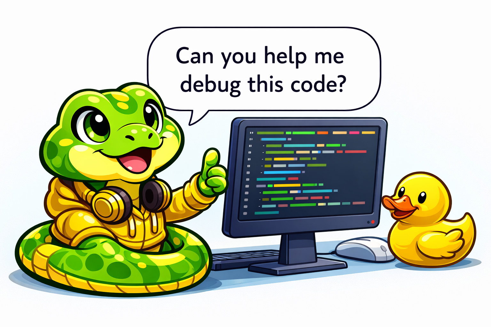

# Testing and Debugging

## Summary

This chapter covers the essential practices of testing and debugging software. Students will learn manual and unit testing, how to write effective test cases and assertions, identify edge cases and boundary conditions, and practice test-driven development. The chapter also teaches debugging strategies including print debugging, using debugger tools with breakpoints, code tracing, and rubber duck debugging. Defensive programming and input validation techniques round out the quality assurance toolkit.

## Concepts Covered

This chapter covers the following 20 concepts from the learning graph:

1. Testing
2. Manual Testing
3. Unit Testing
4. Test Cases
5. Assert Statements
6. Unittest Module
7. Test Functions
8. Edge Cases
9. Boundary Testing
10. Test-Driven Development
11. Debugging
12. Print Debugging
13. Debugger Tools
14. Breakpoints
15. Step Through Code
16. Code Tracing
17. Rubber Duck Debugging
18. Defensive Programming
19. Input Validation
20. Code Review

## Prerequisites

This chapter builds on concepts from:

- [Chapter 1: Introduction to Computer Science](../01-intro-to-computer-science/index.md)
- [Chapter 2: Python Fundamentals](../02-python-fundamentals/index.md)
- [Chapter 4: Control Flow](../04-control-flow/index.md)
- [Chapter 6: Functions and Modular Design](../06-functions-and-modular-design/index.md)
- [Chapter 14: Errors and Exceptions](../14-errors-and-exceptions/index.md)
- [Chapter 16: Software Engineering Practices](../16-software-engineering/index.md)

---

!!! mascot-welcome "Monty says: Let's debug this together!"
    { align=left width="80" }
    Welcome back, coders! Every programmer — from beginners to experts at Google — writes code that has bugs. The difference between a novice and a pro isn't that pros write perfect code. It's that pros know how to *find* and *fix* problems systematically. In this chapter, you'll learn exactly how to do that. Bugs are not failures — they're puzzles to solve! Let's dive in.

## Why Testing Matters

Imagine building a bridge and never checking whether it can hold any weight. That would be terrifying, right? Software works the same way. **Testing** is the process of running your code to check whether it actually does what you intended. Without testing, you're just *hoping* your program works — and hope is not a strategy.

Testing helps you in three big ways:

- **Catch bugs early.** The sooner you find a mistake, the easier (and cheaper) it is to fix.
- **Build confidence.** When your tests pass, you *know* your code works — not just for one case, but for many.
- **Enable change.** Want to refactor your code or add a new feature? If you have good tests, you can make changes without worrying about accidentally breaking something.

Professional software teams spend just as much time writing tests as they do writing the actual program. Let's learn why — and how.

## Manual Testing

The simplest kind of testing is something you've been doing since your first Python program: running your code and checking the output with your own eyes. This is called **manual testing**.

Manual testing means you run the program, feed it some inputs, and visually verify that the outputs are correct. For example, if you write a function that adds two numbers, you might call it with `add(2, 3)` and check that it returns `5`.

```python
def add(a, b):
    return a + b

# Manual testing
print(add(2, 3))    # Should print 5
print(add(-1, 1))   # Should print 0
print(add(0, 0))    # Should print 0
```

Manual testing is a fine starting point, but it has some problems:

| Limitation | Why It's a Problem |
|------------|-------------------|
| Slow | You have to run the program and check results yourself every time |
| Error-prone | You might miss a wrong answer, especially if there's lots of output |
| Not repeatable | You can't easily re-run the exact same checks after changing code |
| Not scalable | Works for 3 tests, but what about 300? |

For small scripts, manual testing can work. But as your programs grow, you need something better — something *automated*.

## Unit Testing

**Unit testing** is the practice of writing small, automated tests that check whether individual pieces (or "units") of your code work correctly. A "unit" is usually a single function or method. Instead of you checking the output with your eyes, the computer checks it for you — automatically, instantly, and as many times as you want.

Think of unit testing like a robot quality inspector on a factory assembly line. Every widget that comes off the line gets checked against a specification. If it passes, great — move on. If it fails, the inspector flags it immediately. Unit tests are your robot inspectors.

Here's the basic idea: for each function you write, you also write one or more test functions that call your code with specific inputs and verify the outputs match your expectations.

```python
def celsius_to_fahrenheit(celsius):
    return celsius * 9/5 + 32

# Unit tests (simple version)
def test_boiling_point():
    result = celsius_to_fahrenheit(100)
    assert result == 212, f"Expected 212, got {result}"

def test_freezing_point():
    result = celsius_to_fahrenheit(0)
    assert result == 32, f"Expected 32, got {result}"

def test_body_temperature():
    result = celsius_to_fahrenheit(37)
    assert result == 98.6, f"Expected 98.6, got {result}"

# Run the tests
test_boiling_point()
test_freezing_point()
test_body_temperature()
print("All tests passed!")
```

If all three tests run without raising an error, you see "All tests passed!" If any assertion fails, Python raises an `AssertionError` and tells you exactly what went wrong. That's the power of automated testing — instant, honest feedback.

## Test Cases

A **test case** is a specific scenario you design to verify one particular behavior of your code. Each test case has three parts:

1. **Setup** — Prepare the inputs and any data your function needs
2. **Action** — Call the function you're testing
3. **Assertion** — Check that the result matches what you expected

Good test cases cover different scenarios — not just the "happy path" where everything goes right, but also unusual or tricky inputs. Here's an example with a function that finds the largest number in a list:

```python
def find_max(numbers):
    if not numbers:
        return None
    biggest = numbers[0]
    for num in numbers:
        if num > biggest:
            biggest = num
    return biggest

# Test case 1: Normal list
assert find_max([3, 1, 4, 1, 5]) == 5

# Test case 2: Single element
assert find_max([42]) == 42

# Test case 3: All same values
assert find_max([7, 7, 7]) == 7

# Test case 4: Negative numbers
assert find_max([-5, -2, -8]) == -2

# Test case 5: Empty list
assert find_max([]) is None
```

Notice how each test case targets a different situation. That's how you build *confidence* that your function works — not by checking one example, but by checking many.

## Assert Statements

You've already seen them in action, but let's formally introduce **assert statements**. An assert statement is Python's built-in way of saying "I expect this to be true — and if it's not, *stop everything and tell me*."

The syntax is simple:

```python
assert condition, "Optional error message"
```

If the condition is `True`, nothing happens — the program keeps running. If the condition is `False`, Python raises an `AssertionError` with your message.

```python
age = 15
assert age >= 0, "Age can't be negative!"       # Passes
assert age < 200, "That's way too old!"          # Passes
assert age >= 18, "Must be 18 or older to vote"  # Fails!
```

Assert statements are perfect for testing because they make your expectations *explicit*. Instead of staring at a `print()` output and thinking "is that right?", an assert either passes silently or screams at you. There's no ambiguity.

!!! mascot-tip "Monty says: Let's code this!"
    { align=left width="80" }
    Pro tip: Always include a descriptive error message in your assert statements. When a test fails at 2 AM the night before your project is due, `"Expected 212, got 213"` is a lot more helpful than just `AssertionError` with no context!

## The Unittest Module

Writing your own test functions with `assert` is a great start, but Python provides a more powerful tool built right into the standard library: the **unittest module**. It gives you a structured framework for organizing, running, and reporting on your tests.

With unittest, you create a test class that inherits from `unittest.TestCase`. Each test method in that class starts with the word `test_`. The framework automatically finds and runs all of these **test functions** for you.

Here's a complete example:

```python
import unittest

def is_palindrome(text):
    """Check if a string reads the same forward and backward."""
    cleaned = text.lower().replace(" ", "")
    return cleaned == cleaned[::-1]

class TestPalindrome(unittest.TestCase):

    def setUp(self):
        """Runs before each test method."""
        self.simple_palindrome = "racecar"
        self.sentence_palindrome = "A man a plan a canal Panama"
        self.not_palindrome = "hello"

    def test_simple_palindrome(self):
        self.assertTrue(is_palindrome(self.simple_palindrome))

    def test_sentence_palindrome(self):
        self.assertTrue(is_palindrome(self.sentence_palindrome))

    def test_not_palindrome(self):
        self.assertFalse(is_palindrome(self.not_palindrome))

    def test_single_character(self):
        self.assertTrue(is_palindrome("a"))

    def test_empty_string(self):
        self.assertTrue(is_palindrome(""))

if __name__ == "__main__":
    unittest.main()
```

Let's break down what's happening:

- **`setUp()`** runs before *each* test method. It's where you prepare test data that multiple tests share.
- Each **`test_` method** checks one specific thing using assertion methods like `assertTrue()`, `assertFalse()`, and `assertEqual()`.
- **`unittest.main()`** discovers and runs all test methods in the class.

When you run this file, you'll see output like:

```
.....
----------------------------------------------------------------------
Ran 5 tests in 0.001s

OK
```

Each dot represents a passing test. If a test fails, you'll see an `F` instead of a dot, plus a detailed error message telling you exactly what went wrong.

Here are the most common unittest assertion methods:

| Method | Checks That... |
|--------|---------------|
| `assertEqual(a, b)` | `a == b` |
| `assertNotEqual(a, b)` | `a != b` |
| `assertTrue(x)` | `x is True` |
| `assertFalse(x)` | `x is False` |
| `assertIn(a, b)` | `a in b` |
| `assertRaises(Error)` | A specific exception is raised |
| `assertIsNone(x)` | `x is None` |


#### Diagram: Unit Test Runner

<iframe src="../../sims/unit-test-runner/main.html" width="100%" height="600px" scrolling="no"></iframe>

<details markdown="1">
<summary>MicroSim: Unit Test Runner Visualization</summary>
Type: microsim
**sim-id:** unit-test-runner<br/>
**Library:** p5.js<br/>
**Status:** Specified

**Bloom Level:** Apply (L3)
**Bloom Verb:** execute, interpret

**Learning Objective:** Students will be able to trace the execution of a unit test suite and interpret pass/fail results to identify which test cases succeeded and which revealed bugs.

**Purpose:** An animated visualization showing how a unittest framework discovers, runs, and reports on test methods. Students watch tests execute one by one and see pass/fail indicators update in real time.

**Layout:**
- Left panel: Source code of a simple function (e.g., `find_max`) with a subtle bug
- Right panel: A list of 5 test cases, each showing status (pending, running, pass, fail)
- Bottom: A results summary bar showing total passed/failed

**Interactive elements:**
- "Run All Tests" button to execute the entire suite
- "Step" button to run one test at a time
- "Fix Bug" button that corrects the code and lets students re-run
- Tests turn green (pass) or red (fail) as they execute

**Visual style:** Clean code display with syntax highlighting, traffic-light colored status indicators
**Responsive:** Two-panel layout collapses to single column on narrow screens

**Instructional Rationale:** Watching tests execute sequentially builds understanding of how test frameworks operate. The deliberate bug encourages students to interpret failure messages and connect them back to the source code.
</details>

## Edge Cases and Boundary Testing

Here's a secret that experienced programmers know: most bugs hide at the edges. An **edge case** is an unusual or extreme input that your function might not handle correctly. **Boundary testing** focuses specifically on values right at the limits of what your code is supposed to handle.

Think of it like a fence around a yard. You don't just check whether the fence works in the middle — you check the corners, the gates, and the posts at each end. Those boundaries are where things are most likely to go wrong.

Common edge cases to test:

| Input Type | Edge Cases to Try |
|-----------|-------------------|
| Numbers | 0, negative numbers, very large numbers, decimals |
| Strings | Empty string `""`, single character, very long string, special characters |
| Lists | Empty list `[]`, list with one item, list with duplicates |
| Booleans | Both `True` and `False` |
| Division | Dividing by zero |
| Indices | First item, last item, out of range |

Here's an example that shows why edge cases matter:

```python
def calculate_average(grades):
    """Calculate the average of a list of grades."""
    total = sum(grades)
    return total / len(grades)

# Normal test - works fine
assert calculate_average([90, 80, 70]) == 80.0

# Edge case - empty list!
# calculate_average([])  # ZeroDivisionError!
```

Oops! Our function crashes on an empty list because it tries to divide by zero. Let's fix it:

```python
def calculate_average(grades):
    """Calculate the average of a list of grades."""
    if not grades:
        return 0.0
    total = sum(grades)
    return total / len(grades)

# Now the edge case is handled
assert calculate_average([]) == 0.0
assert calculate_average([100]) == 100.0
assert calculate_average([90, 80, 70]) == 80.0
```

**Boundary testing** is a specific type of edge case testing where you focus on boundary values. If a function is supposed to accept grades between 0 and 100, you'd test:

- The exact boundaries: `0` and `100`
- Just inside: `1` and `99`
- Just outside: `-1` and `101`

```python
def is_valid_grade(grade):
    """Return True if grade is between 0 and 100 inclusive."""
    return 0 <= grade <= 100

# Boundary tests
assert is_valid_grade(0) == True      # Lower boundary
assert is_valid_grade(100) == True    # Upper boundary
assert is_valid_grade(1) == True      # Just inside lower
assert is_valid_grade(99) == True     # Just inside upper
assert is_valid_grade(-1) == False    # Just outside lower
assert is_valid_grade(101) == False   # Just outside upper
```

!!! mascot-thinking "Monty says: You've got this!"
    { align=left width="80" }
    Here's a pattern to remember: whenever you write a function, ask yourself "What's the weirdest thing someone could pass in?" An empty list, a negative number, a string with only spaces, `None`... Testing the weird stuff is where you find the most bugs!

#### Diagram: Boundary Testing Playground

<iframe src="../../sims/boundary-testing/main.html" width="100%" height="600px" scrolling="no"></iframe>

<details markdown="1">
<summary>MicroSim: Boundary Testing Playground</summary>

Type: microsim
**sim-id:** boundary-testing<br/>
**Library:** p5.js<br/>
**Status:** Specified

**Bloom Level:** Apply (L3)
**Bloom Verb:** test, identify

**Learning Objective:** Students will be able to identify boundary values for a given function specification and predict whether each test input will pass or fail.

**Purpose:** An interactive playground where students select boundary values on a number line to test against a function. They predict pass/fail, then run the test to check their prediction.

**Layout:**
- Top: Function specification card (e.g., "Accept ages 13-19 for teen discount")
- Middle: A number line from -10 to 30 with clickable points
- Bottom: Test results panel showing predictions vs. actual results

**Interactive elements:**
- Click points on the number line to select test values
- For each selected value, choose "predict pass" or "predict fail"
- "Run Tests" button executes all selected test cases
- Color coding shows correct predictions (green) vs. incorrect (red)
- "New Function" button loads a different specification

**Visual style:** Clean number line with color-coded regions (valid range in green, invalid in gray)
**Responsive:** Number line scales to canvas width

**Instructional Rationale:** Having students predict outcomes before seeing results activates the Apply level by requiring them to reason about boundary conditions rather than passively observing. The immediate feedback loop reinforces correct mental models.
</details>

## Test-Driven Development

What if you wrote your tests *before* you wrote your code? That might sound backward, but it's actually a powerful technique called **Test-Driven Development** (TDD). The idea is simple: define what "correct" looks like first, then write the code to make it happen.

TDD follows a three-step cycle known as **Red, Green, Refactor**:

1. **Red** — Write a test for a feature that doesn't exist yet. Run it. It fails (red).
2. **Green** — Write the *simplest* code that makes the test pass. Run it. It passes (green).
3. **Refactor** — Clean up your code without changing its behavior. Run the tests again to make sure everything still passes.

Then you repeat the cycle for the next feature.

```python
# === STEP 1: RED ===
# Write the test first (the function doesn't exist yet!)
import unittest

class TestFizzBuzz(unittest.TestCase):
    def test_regular_number(self):
        self.assertEqual(fizzbuzz(1), "1")

    def test_divisible_by_3(self):
        self.assertEqual(fizzbuzz(3), "Fizz")

    def test_divisible_by_5(self):
        self.assertEqual(fizzbuzz(5), "Buzz")

    def test_divisible_by_15(self):
        self.assertEqual(fizzbuzz(15), "FizzBuzz")
```

If you try to run these tests now, they'll crash because `fizzbuzz` doesn't exist. That's the Red step — your tests are failing.

```python
# === STEP 2: GREEN ===
# Write the simplest code to pass the tests
def fizzbuzz(n):
    if n % 15 == 0:
        return "FizzBuzz"
    elif n % 3 == 0:
        return "Fizz"
    elif n % 5 == 0:
        return "Buzz"
    else:
        return str(n)
```

Now run the tests — they all pass! That's the Green step.

```python
# === STEP 3: REFACTOR ===
# The code is already clean, but maybe we want to add more tests
# for edge cases before moving on
class TestFizzBuzz(unittest.TestCase):
    def test_regular_number(self):
        self.assertEqual(fizzbuzz(1), "1")

    def test_divisible_by_3(self):
        self.assertEqual(fizzbuzz(3), "Fizz")

    def test_divisible_by_5(self):
        self.assertEqual(fizzbuzz(5), "Buzz")

    def test_divisible_by_15(self):
        self.assertEqual(fizzbuzz(15), "FizzBuzz")

    def test_large_number(self):
        self.assertEqual(fizzbuzz(30), "FizzBuzz")

    def test_number_two(self):
        self.assertEqual(fizzbuzz(2), "2")
```

Why does TDD work so well? Because you always know exactly what you're trying to build. The tests are your roadmap. You never write code that isn't needed, and you always know when you're done.

#### Diagram: TDD Cycle

<iframe src="../../sims/tdd-cycle/main.html" width="100%" height="600px" scrolling="no"></iframe>

<details markdown="1">
<summary>Diagram: TDD Red-Green-Refactor Cycle</summary>

Type: infographic
**sim-id:** tdd-cycle<br/>
**Library:** p5.js<br/>
**Status:** Specified

**Bloom Level:** Understand (L2)
**Bloom Verb:** describe, explain

**Learning Objective:** Students will be able to describe the three phases of the Test Driven Development (TDD) cycle (Red, Green, Refactor) and explain the purpose of each phase.

**Purpose:** An animated circular diagram showing the TDD cycle with three nodes connected by arrows. Each phase includes a brief description and a code snippet example.

**Layout:**
- Circular arrangement with three large nodes at 12 o'clock (Red), 4 o'clock (Green), and 8 o'clock (Refactor)
- Arrows connecting Red to Green to Refactor and back to Red
- Center text: "TDD Cycle"

**Nodes:**
1. Red (red circle): "Write a failing test" - shows a test with a red X
2. Green (green circle): "Write code to pass" - shows code with a green checkmark
3. Refactor (blue circle): "Clean up the code" - shows improved code with a green checkmark

**Interactive elements:**
- Click any node to see a detailed example with code snippets
- "Animate Cycle" button rotates through all three phases with explanations
- Hover reveals the key question for each phase ("What should it do?", "What's the simplest fix?", "Can I make it cleaner?")

**Visual style:** Bold colored circles with clean connecting arrows, modern flat design
**Responsive:** Circle scales proportionally with canvas

**Instructional Rationale:** The circular visual reinforces that TDD is an ongoing cycle, not a one-time process. Interactive exploration lets students absorb each phase at their own pace.
</details>

## What Is Debugging?

You've written your tests. Some of them are failing. Now what? Time to **debug**! **Debugging** is the process of finding and fixing errors (bugs) in your code. The term supposedly comes from an actual bug — a moth that was found stuck inside an early computer in 1947, causing it to malfunction. (Yes, really.)

Debugging is part detective work, part puzzle solving. You know something is wrong (your test fails, or your program produces unexpected output). Now you have to figure out *where* the problem is and *why* it's happening.

Here's a general debugging process:

1. **Reproduce** the bug — Make it happen consistently
2. **Isolate** the problem — Narrow down *where* in the code the bug lives
3. **Identify** the cause — Figure out *why* the code behaves incorrectly
4. **Fix** the bug — Change the code to correct the behavior
5. **Verify** the fix — Run your tests to confirm the bug is gone and nothing else broke

Let's look at the specific debugging techniques you can use.

## Print Debugging

The simplest debugging technique is also one of the most common: **print debugging**. You add `print()` statements to your code to display the values of variables at different points during execution. It's like leaving yourself breadcrumbs through a dark forest.

```python
def find_second_largest(numbers):
    # print debugging to trace values
    print(f"Input: {numbers}")

    largest = numbers[0]
    second = numbers[0]

    for num in numbers:
        print(f"  Checking {num}: largest={largest}, second={second}")
        if num > largest:
            second = largest
            largest = num
        elif num > second:
            second = num

    print(f"Result: largest={largest}, second={second}")
    return second

# Something seems wrong...
result = find_second_largest([3, 1, 4, 1, 5])
print(f"Second largest: {result}")
```

Running this would show you the value of every variable at each step, making it much easier to spot where things go wrong.

Print debugging is quick and easy, but it has downsides:

- You have to remember to remove all those `print()` statements when you're done
- It clutters your code while you're debugging
- For complex programs, you might need *dozens* of print statements

Still, don't underestimate it. Even experienced developers reach for `print()` debugging regularly. It works.

## Debugger Tools

For more complex bugs, you need more powerful tools. A **debugger tool** is a program that lets you pause your code mid-execution and inspect everything that's happening — variables, the call stack, the flow of execution — without adding print statements.

Python comes with a built-in debugger called `pdb`, and most code editors (like VS Code, PyCharm, and Thonny) have visual debuggers built right in. Visual debuggers are especially beginner-friendly because you can see your code, your variables, and the execution flow all at once.

Here's what a debugger typically lets you do:

| Feature | What It Does |
|---------|-------------|
| **Pause execution** | Stop the program at any point to examine state |
| **Inspect variables** | See the current value of every variable |
| **View call stack** | See which functions called which |
| **Control execution** | Move through your code line by line |
| **Evaluate expressions** | Type in expressions to test on the fly |

### Breakpoints

A **breakpoint** is a marker you place on a specific line of code that tells the debugger "stop here." When the program reaches that line, it pauses, and you can look around at the state of everything.

In most editors, you set a breakpoint by clicking in the left margin next to a line number. A red dot appears, and the next time you run the program in debug mode, it'll stop at that line.

```python
def calculate_discount(price, discount_percent):
    # Set a breakpoint on the next line to inspect values
    discount_amount = price * discount_percent / 100  # <-- breakpoint here
    final_price = price - discount_amount
    return final_price

result = calculate_discount(50, 20)
```

When the debugger pauses at the breakpoint, you can see that `price` is `50`, `discount_percent` is `20`, and `discount_amount` is about to be calculated. You can then **step through code** line by line to watch the calculation unfold.

### Step Through Code

Once your program is paused at a breakpoint, you can **step through code** — executing one line at a time. Most debuggers offer three stepping options:

- **Step Over** — Run the current line and move to the next one (if the line calls a function, run the whole function without going inside it)
- **Step Into** — If the current line calls a function, jump inside that function and pause at its first line
- **Step Out** — Finish running the current function and pause when you return to the caller

Stepping through code is like watching a movie in slow motion. You see exactly what happens at each moment, which makes it much easier to spot the frame where things go wrong.

#### Diagram: Visual Debugger Simulator
<iframe src="../../sims/visual-debugger/main.html" width="100%" height="600px" scrolling="no"></iframe>
<details markdown="1">
<summary>MicroSim: Visual Debugger Simulator</summary>

Type: microsim
**sim-id:** visual-debugger<br/>
**Library:** p5.js<br/>
**Status:** Specified

**Bloom Level:** Apply (L3)
**Bloom Verb:** execute, trace

**Learning Objective:** Students will be able to use breakpoints and step-through controls to trace the execution of a Python function and identify where a bug occurs.

**Purpose:** A simulated debugger environment where students can set breakpoints, step through code line by line, and watch variable values change in real time.

**Layout:**
- Left panel: Python code with line numbers (a function with a subtle bug)
- Right panel: Variable inspector showing current values
- Bottom: Debugger controls (Step Over, Step Into, Step Out, Continue, Reset)
- Current line highlighted in yellow

**Interactive elements:**
- Click line numbers to toggle breakpoints (red dots)
- "Run" button starts execution, pausing at first breakpoint
- Step buttons advance execution one line at a time
- Variable panel updates in real time as values change
- Output console shows any print() output
- "Find the Bug" challenge mode that asks students to identify the buggy line

**Visual style:** Dark code editor theme with syntax highlighting, professional debugger appearance
**Responsive:** Panels stack vertically on narrow screens

**Instructional Rationale:** Hands-on debugger experience in a safe, simulated environment removes the intimidation factor of real debugger tools. Students build muscle memory for the step/inspect workflow before encountering it in their actual IDE.
</details>

## Code Tracing

**Code tracing** is the technique of manually stepping through your code with pen and paper (or in your head), keeping track of every variable's value as each line executes. It's like being a human debugger.

Here's how you trace code. Take this function:

```python
def mystery(n):
    result = 0
    for i in range(1, n + 1):
        result = result + i
    return result

print(mystery(4))
```

To trace it, you create a table that tracks every variable at each step:

| Step | Line | `n` | `i` | `result` | Notes |
|------|------|-----|-----|----------|-------|
| 1 | `result = 0` | 4 | — | 0 | Initialize result |
| 2 | `for i in range(1, 5)` | 4 | 1 | 0 | First loop iteration |
| 3 | `result = result + i` | 4 | 1 | 1 | 0 + 1 = 1 |
| 4 | `for i in range(1, 5)` | 4 | 2 | 1 | Second iteration |
| 5 | `result = result + i` | 4 | 2 | 3 | 1 + 2 = 3 |
| 6 | `for i in range(1, 5)` | 4 | 3 | 3 | Third iteration |
| 7 | `result = result + i` | 4 | 3 | 6 | 3 + 3 = 6 |
| 8 | `for i in range(1, 5)` | 4 | 4 | 6 | Fourth iteration |
| 9 | `result = result + i` | 4 | 4 | 10 | 6 + 4 = 10 |
| 10 | `return result` | 4 | — | 10 | Returns 10 |

The function computes 1 + 2 + 3 + 4 = 10. Code tracing is a skill that's tested on the AP exam, so practicing it now will pay off later. It's also a great way to understand someone else's code — or to figure out why your own code isn't doing what you expected.

## Rubber Duck Debugging

{ width="400px", align="right"}

This is going to sound silly, but bear with us. **Rubber duck debugging** is a technique where you explain your code, line by line, to a rubber duck (or any inanimate object — a stuffed animal, a houseplant, a very patient pet).

Why does this work? Because the act of *explaining* your code forces you to slow down and think about what each line actually does. When you're just reading code in your head, it's easy to skip over the problem. But when you have to articulate "this line takes the list and... wait, it should be sorting it, but I'm calling `reverse()` instead of `sort()`!" — the bug reveals itself.

Here's the official rubber duck debugging protocol:

1. Get a rubber duck (or any willing listener — including stuffed animals and coffee mugs)
2. Place the duck on your desk
3. Explain your code to the duck, line by line
4. When you reach the line where what you *say* doesn't match what the code *does* — that's your bug!

This technique was popularized by the book *The Pragmatic Programmer*, and developers around the world swear by it. Some software companies even keep rubber ducks at every desk. It sounds ridiculous, but it genuinely works.

Why? Because there's a difference between *reading* code and *understanding* code. When you explain it out loud, you switch from passively scanning to actively reasoning. Your brain processes the logic differently when you have to put it into words.

!!! mascot-encourage "Monty says: Let's debug this together!"
    { align=left width="80" }
    If you don't have a rubber duck, you can always explain your code to me! But seriously — talking through your code out loud is one of the most effective debugging techniques out there. Try it next time you're stuck. You'll be amazed at how often the bug just pops out while you're explaining the code.

## Debugging Strategies Comparison

Here's a handy reference comparing all the debugging techniques we've covered:

| Strategy | How It Works | Best For | Difficulty |
|----------|-------------|----------|------------|
| **Print Debugging** | Add `print()` statements to show variable values | Quick checks, simple bugs | Beginner |
| **Debugger Tools** | Use breakpoints and step-through in an IDE | Complex bugs, understanding flow | Intermediate |
| **Code Tracing** | Manually track variables on paper | Understanding logic, exam prep | Beginner |
| **Rubber Duck** | Explain code out loud to find logical errors | Logic bugs, when you're stuck | Beginner |
| **Breakpoints** | Pause execution at specific lines | Targeting a specific area | Intermediate |
| **Step Through** | Execute one line at a time in the debugger | Watching variable changes | Intermediate |

Each strategy has its place. Smart debuggers use *multiple* techniques. Start with the simple ones (print, rubber duck), and reach for the debugger when those aren't enough.

<details markdown="1">
<summary>Diagram: Debugging Decision Flowchart</summary>

#### Diagram: Which Debugging Strategy Should You Use?

Type: infographic
**sim-id:** debugging-flowchart<br/>
**Library:** p5.js<br/>
**Status:** Specified

**Bloom Level:** Analyze (L4)
**Bloom Verb:** choose, determine

**Learning Objective:** Students will be able to select an appropriate debugging strategy based on the type of bug and context.

**Purpose:** A decision tree flowchart that guides students through choosing the right debugging technique based on their situation.

**Layout:**
- Start node: "I have a bug!"
- Decision diamonds: "Do you know roughly where the bug is?", "Is it a logic error or a crash?", "Is the code short enough to trace by hand?"
- Leaf nodes: Each debugging technique with a brief tip

**Flow:**
- Know where? Yes -> Breakpoint + Step Through. No -> continue
- Crash or logic? Crash -> Print debugging to find the line. Logic -> continue
- Short enough to trace? Yes -> Code Tracing. No -> Rubber Duck first, then Debugger

**Interactive elements:**
- Click decision diamonds to follow the path
- Each leaf node expands to show a mini-tutorial for that technique
- "Start Over" button resets to the beginning

**Visual style:** Clean flowchart with rounded rectangles and diamond shapes, color-coded paths
**Responsive:** Flowchart scales and repositions on resize

**Instructional Rationale:** A decision tree teaches the metacognitive skill of choosing the right tool for the job, which is a higher-order thinking skill (Analyze level). Students internalize a problem-solving strategy, not just a list of techniques.
</details>

## Defensive Programming

So far, we've talked about finding and fixing bugs after they happen. But what if you could *prevent* bugs from happening in the first place? That's the idea behind **defensive programming** — writing code that anticipates problems and handles them gracefully, rather than crashing unexpectedly.

Defensive programming means assuming that things *will* go wrong and preparing for it. It's like wearing a seatbelt — you hope you never need it, but you're glad it's there when you do.

Key defensive programming practices:

- **Check your inputs** before using them
- **Handle edge cases** explicitly
- **Use try-except blocks** to catch potential errors
- **Validate data** before processing it
- **Add assertions** to check assumptions in your code

Here's a function written *without* defensive programming:

```python
# Fragile — crashes on bad input
def divide(a, b):
    return a / b
```

And here's the same function written *with* defensive programming:

```python
# Defensive — handles problems gracefully
def divide(a, b):
    if not isinstance(a, (int, float)):
        raise TypeError(f"Expected a number, got {type(a).__name__}")
    if not isinstance(b, (int, float)):
        raise TypeError(f"Expected a number, got {type(b).__name__}")
    if b == 0:
        raise ValueError("Cannot divide by zero")
    return a / b
```

The defensive version checks everything before attempting the division. If something is wrong, it raises a clear, descriptive error instead of crashing with a confusing traceback.

## Input Validation

A specific form of defensive programming is **input validation** — checking that data from the user (or any external source) is correct, safe, and sensible before your program uses it.

Users are creative. They'll type letters where you expect numbers, leave fields blank, enter negative ages, and paste entire novels into a "phone number" field. Your job as a programmer is to expect the unexpected.

```python
def get_age():
    """Get a valid age from the user."""
    while True:
        user_input = input("Enter your age: ")

        # Check that it's a number
        if not user_input.isdigit():
            print("Please enter a positive whole number.")
            continue

        age = int(user_input)

        # Check that it's reasonable
        if age < 0 or age > 150:
            print("Please enter a realistic age (0-150).")
            continue

        return age
```

This function refuses to accept bad input. It keeps asking until the user provides something valid. That's input validation in action.

Here's a more thorough example for a password validator:

```python
def validate_password(password):
    """Check if a password meets security requirements."""
    errors = []

    if len(password) < 8:
        errors.append("Password must be at least 8 characters")

    if not any(c.isupper() for c in password):
        errors.append("Password must contain an uppercase letter")

    if not any(c.islower() for c in password):
        errors.append("Password must contain a lowercase letter")

    if not any(c.isdigit() for c in password):
        errors.append("Password must contain a digit")

    if errors:
        return False, errors
    return True, ["Password is valid!"]

# Test it
valid, messages = validate_password("abc")
print(valid)       # False
print(messages)    # ['Password must be at least 8 characters',
                   #  'Password must contain an uppercase letter',
                   #  'Password must contain a digit']
```

!!! mascot-warning "Monty says: Let's debug this together!"
    { align=left width="80" }
    Never trust user input! Even if your program is just a class project, get in the habit of validating inputs. In professional software, unvalidated input is one of the top causes of security vulnerabilities and crashes. Build the habit now, and future-you will thank you.

<details markdown="1">
<summary>MicroSim: Input Validation Tester</summary>

#### Diagram: Input Validation Tester

Type: microsim
**sim-id:** input-validation-tester<br/>
**Library:** p5.js<br/>
**Status:** Specified

**Bloom Level:** Apply (L3)
**Bloom Verb:** test, validate

**Learning Objective:** Students will be able to write and test input validation rules for common data types (age, email, password) and predict which inputs will pass or fail validation.

**Purpose:** An interactive tool where students define validation rules and then test various inputs against them, seeing which pass and which fail with specific error messages.

**Layout:**
- Top: Dropdown to select validation scenario (Age, Email, Password, Grade)
- Middle: Input field where students type test values
- Right: Validation rules panel showing the current rules
- Bottom: Results log showing pass/fail history with reasons

**Interactive elements:**
- Type any input and press "Validate" to check it
- Green/red indicator for pass/fail
- Error messages explain exactly why validation failed
- "Challenge Mode" presents tricky inputs and asks students to predict pass/fail before checking

**Visual style:** Form-like layout with clear pass/fail indicators
**Responsive:** Single column layout that works on all screen sizes

**Instructional Rationale:** Hands-on testing of validation rules builds practical skill in thinking about edge cases and boundary conditions in real-world input scenarios.
</details>

## Code Review

The last quality assurance technique in our toolkit is **code review** — having another person read your code and provide feedback. Code review is standard practice at every professional software company. At Google, for example, *every single line of code* must be reviewed by at least one other engineer before it can be added to the codebase.

Why is code review so valuable?

- **Fresh eyes catch bugs** you've become blind to after staring at the code for hours
- **Knowledge sharing** — reviewers learn about your code, and you learn from their feedback
- **Better design** — explaining your code to someone else (sound familiar?) often reveals improvements
- **Consistency** — reviewers can catch style issues and ensure the code follows team conventions

Here's what a code review typically focuses on:

| Area | Questions to Ask |
|------|-----------------|
| **Correctness** | Does the code actually do what it's supposed to? |
| **Readability** | Can someone else understand this code easily? |
| **Edge cases** | Are unusual inputs handled? |
| **Efficiency** | Is there an obviously better way to do this? |
| **Style** | Does it follow PEP 8 and team conventions? |
| **Tests** | Are there tests? Do they cover the important cases? |
| **Naming** | Are variable and function names clear and descriptive? |

You don't need to be a professional to practice code review. Swap code with a classmate, review each other's homework, or even review your own code after taking a break. A few hours away from your code gives you fresh eyes — you'll be surprised what you catch.

Here's a simple code review checklist you can use:

```python
# CODE REVIEW CHECKLIST
# [ ] Does the code run without errors?
# [ ] Are variable names descriptive?
# [ ] Are there comments where needed?
# [ ] Are edge cases handled?
# [ ] Is the code DRY (no unnecessary repetition)?
# [ ] Are there tests?
# [ ] Would I understand this code in 3 months?
```

## Putting It All Together: A Complete Example

Let's tie everything together with a real-world example. We'll build a `GradeBook` class using TDD, defensive programming, and thorough testing.

```python
import unittest

class GradeBook:
    """A simple grade book that stores and analyzes student grades."""

    def __init__(self):
        self.grades = {}

    def add_grade(self, student, grade):
        """Add a grade for a student. Validates inputs."""
        # Input validation
        if not isinstance(student, str) or not student.strip():
            raise ValueError("Student name must be a non-empty string")
        if not isinstance(grade, (int, float)):
            raise TypeError("Grade must be a number")
        if grade < 0 or grade > 100:
            raise ValueError("Grade must be between 0 and 100")

        student = student.strip()
        if student not in self.grades:
            self.grades[student] = []
        self.grades[student].append(grade)

    def get_average(self, student):
        """Get a student's average grade."""
        if student not in self.grades:
            raise KeyError(f"Student '{student}' not found")
        grades = self.grades[student]
        return sum(grades) / len(grades)

    def get_highest(self):
        """Get the student with the highest average."""
        if not self.grades:
            return None
        best_student = None
        best_avg = -1
        for student in self.grades:
            avg = self.get_average(student)
            if avg > best_avg:
                best_avg = avg
                best_student = student
        return best_student, best_avg


class TestGradeBook(unittest.TestCase):

    def setUp(self):
        """Create a fresh grade book for each test."""
        self.gb = GradeBook()

    # --- Test add_grade ---
    def test_add_single_grade(self):
        self.gb.add_grade("Alice", 95)
        self.assertIn("Alice", self.gb.grades)
        self.assertEqual(self.gb.grades["Alice"], [95])

    def test_add_multiple_grades(self):
        self.gb.add_grade("Bob", 80)
        self.gb.add_grade("Bob", 90)
        self.assertEqual(self.gb.grades["Bob"], [80, 90])

    # --- Test input validation ---
    def test_invalid_student_name(self):
        with self.assertRaises(ValueError):
            self.gb.add_grade("", 85)

    def test_grade_too_high(self):
        with self.assertRaises(ValueError):
            self.gb.add_grade("Alice", 105)

    def test_grade_too_low(self):
        with self.assertRaises(ValueError):
            self.gb.add_grade("Alice", -5)

    def test_non_numeric_grade(self):
        with self.assertRaises(TypeError):
            self.gb.add_grade("Alice", "A+")

    # --- Test get_average ---
    def test_average_single_grade(self):
        self.gb.add_grade("Alice", 90)
        self.assertEqual(self.gb.get_average("Alice"), 90.0)

    def test_average_multiple_grades(self):
        self.gb.add_grade("Alice", 80)
        self.gb.add_grade("Alice", 90)
        self.gb.add_grade("Alice", 100)
        self.assertEqual(self.gb.get_average("Alice"), 90.0)

    def test_average_unknown_student(self):
        with self.assertRaises(KeyError):
            self.gb.get_average("Nobody")

    # --- Test get_highest ---
    def test_highest_single_student(self):
        self.gb.add_grade("Alice", 95)
        name, avg = self.gb.get_highest()
        self.assertEqual(name, "Alice")

    def test_highest_multiple_students(self):
        self.gb.add_grade("Alice", 85)
        self.gb.add_grade("Bob", 92)
        self.gb.add_grade("Charlie", 88)
        name, avg = self.gb.get_highest()
        self.assertEqual(name, "Bob")

    # --- Edge cases ---
    def test_highest_empty_gradebook(self):
        self.assertIsNone(self.gb.get_highest())

    def test_boundary_grade_zero(self):
        self.gb.add_grade("Alice", 0)
        self.assertEqual(self.gb.get_average("Alice"), 0.0)

    def test_boundary_grade_hundred(self):
        self.gb.add_grade("Alice", 100)
        self.assertEqual(self.gb.get_average("Alice"), 100.0)


if __name__ == "__main__":
    unittest.main()
```

This example shows everything working together: a well-tested class with input validation, edge case handling, boundary testing, and organized test cases using the unittest module. Notice how the test class has a `setUp` method that creates a fresh `GradeBook` for each test, ensuring tests don't interfere with each other.

!!! mascot-celebration "Monty says: You've got this!"
    { align=left width="80" }
    Amazing work getting through this chapter, coders! You now have a complete testing and debugging toolkit. Remember: every professional programmer writes bugs. What makes you a *great* programmer isn't writing perfect code — it's knowing how to find and fix problems quickly. Keep testing, keep debugging, and keep coding!

## Key Takeaways

- **Testing** is the process of verifying that your code works correctly. Start with manual testing, then level up to automated unit tests.
- **Unit testing** checks individual functions in isolation. Python's **unittest module** provides a structured framework with `setUp()`, test methods, and assertion helpers.
- **Test cases** should cover normal inputs, **edge cases** (unusual inputs), and **boundary values** (inputs at the limits).
- **Assert statements** make your expectations explicit: if the condition is false, the program raises an error immediately.
- **Test-Driven Development** (TDD) follows the Red-Green-Refactor cycle: write a failing test, make it pass, then clean up.
- **Debugging** is a systematic process: reproduce, isolate, identify, fix, verify.
- **Print debugging** uses `print()` to inspect variable values. **Debugger tools** use **breakpoints** and **step through code** for more powerful inspection.
- **Code tracing** means manually tracking variable values on paper — essential for understanding logic and for AP exam prep.
- **Rubber duck debugging** works by forcing you to explain your code out loud, which reveals logic errors.
- **Defensive programming** anticipates problems before they happen. **Input validation** ensures user data is correct and safe before your program uses it.
- **Code review** uses fresh eyes to catch bugs, share knowledge, and improve code quality.

??? question "Check Your Understanding: What are the three steps of the TDD cycle?"
    The three steps are **Red, Green, Refactor**: (1) **Red** — write a test that fails because the feature doesn't exist yet. (2) **Green** — write the simplest code that makes the test pass. (3) **Refactor** — clean up the code while keeping all tests passing. Then repeat the cycle for the next feature.

??? question "Check Your Understanding: Why is testing edge cases important?"
    Edge cases are unusual or extreme inputs (like empty lists, negative numbers, or very large values) that are most likely to reveal bugs. Most bugs hide at the edges of what your code handles, not in the typical "happy path." Testing edge cases ensures your code is robust and handles all situations — not just the easy ones.

??? question "Check Your Understanding: How does rubber duck debugging work, and why is it effective?"
    Rubber duck debugging involves explaining your code, line by line, to a rubber duck (or any inanimate object). It works because the act of putting your logic into words forces you to think carefully about what each line actually does. When what you *say* doesn't match what the code *does*, you've found your bug. It's effective because it switches your brain from passively reading to actively reasoning about the code.
