# MicroSims

Interactive simulations that let you explore computer science concepts
by experimenting in real time. Click any card to launch the MicroSim.

**Total MicroSims:** 50 | **Chapters covered:** 8

## Chapter 1: Intro to Computer Science

-   **[Computational Thinking Pillars](./computational-thinking-pillars/index.md)**

    

    Visualize the four pillars of computational thinking: decomposition, pattern recognition, abstraction, and algorithms.

-   **[Inside a Computer](./inside-a-computer/index.md)**

    

    Explore the internal components of a computer and how they work together.

-   **[Binary Number Explorer](./binary-number-explorer/index.md)**

    

    Convert between binary and decimal and see how computers represent numbers.

-   **[ASCII Character Map](./ascii-character-map/index.md)**

    

    Discover how characters are encoded as numbers using the ASCII standard.

-   **[Symbol Character Quiz](./symbol-character-quiz/index.md)**

    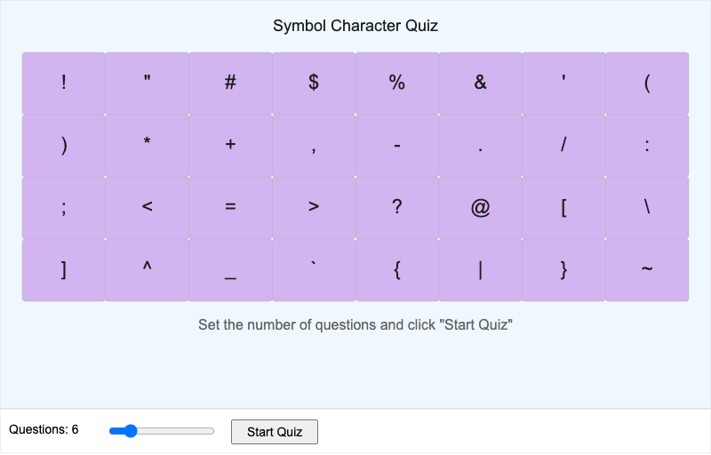

    Test your knowledge of ASCII symbol characters by identifying them by name.

-   **[Python vs Java Language Trends](./cs-lang-trends/index.md)**

    

    Compare the popularity of Python and Java from 2010 to 2025 in an interactive line chart.

-   **[Compiled vs. Interpreted Languages](./compiled-vs-interpreted/index.md)**

    

    Compare how compiled and interpreted languages turn source code into running programs.

## Chapter 2: Python Fundamentals

-   **[Python REPL vs. Scripts](./repl-vs-scripts/index.md)**

    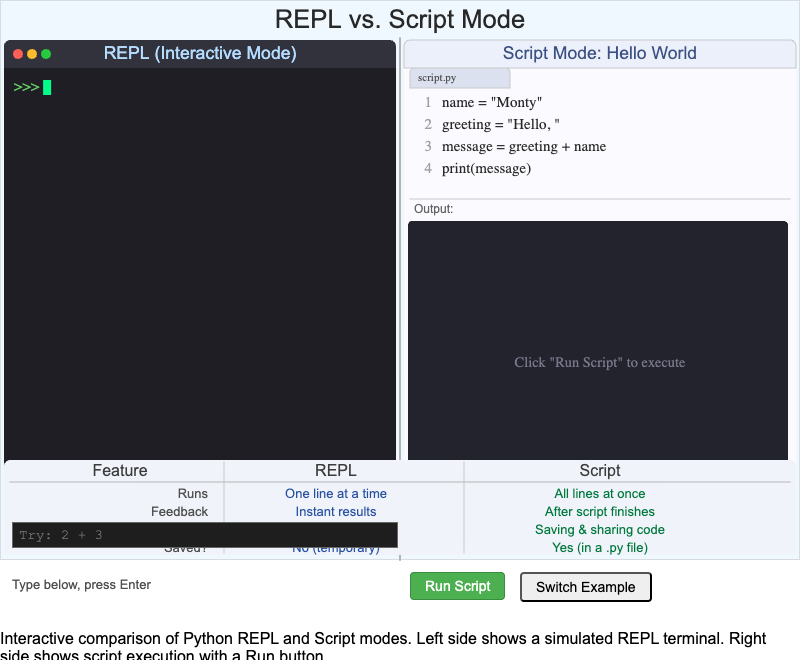

    Compare interactive REPL mode with running saved Python scripts.

-   **[Python Data Types Overview](./python-data-types/index.md)**

    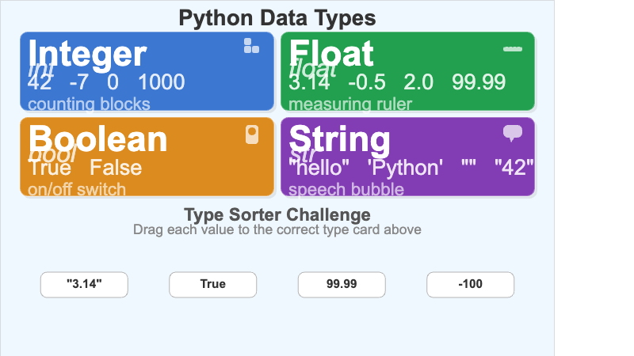

    Explore Python's built-in data types and how they behave.

-   **[Arithmetic Operators Explorer](./arithmetic-operators/index.md)**

    

    Try out Python's arithmetic operators and see results update live.

-   **[String Operations Playground](./string-operations/index.md)**

    

    Experiment with slicing, concatenation, and other string operations.

-   **[Expressions vs. Statements](./expressions-vs-statements/index.md)**

    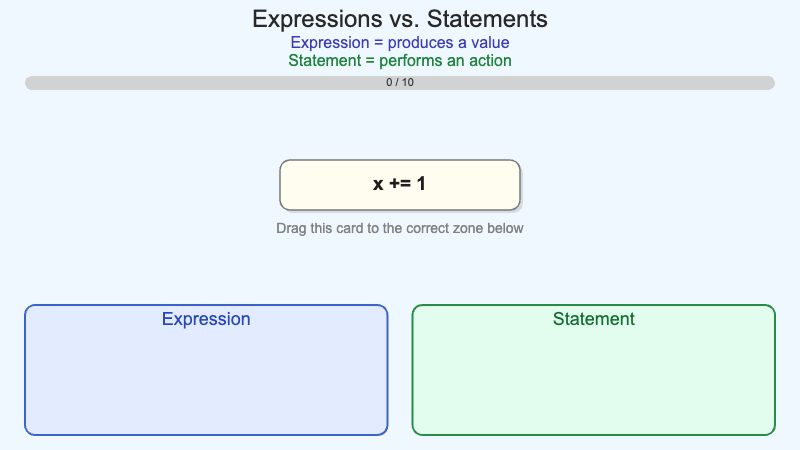

    Learn the difference between expressions that produce values and statements that perform actions.

-   **[Code Readability Comparison](./code-readability/index.md)**

    

    See how formatting and naming choices affect how easy code is to read.

## Chapter 3: Boolean Logic

-   **[Comparison Operator Explorer](./comparison-operator-explorer/index.md)**

    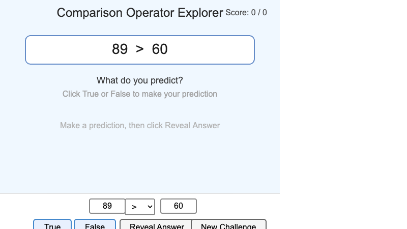

    Test comparison operators and see how Python evaluates them to True or False.

-   **[Logical Operator Venn Diagrams](./logical-operator-venn/index.md)**

    

    Visualize AND, OR, and NOT using interactive Venn diagrams.

-   **[Interactive Truth Table Builder](./truth-table-builder/index.md)**

    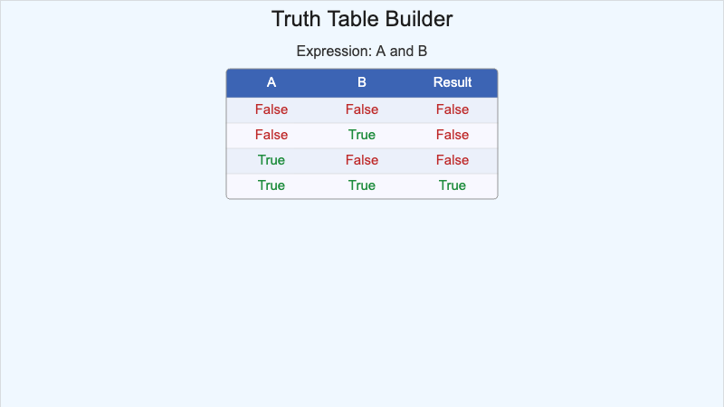

    Build truth tables for Boolean expressions and check your understanding.

-   **[Truthiness Tester](./truthiness-tester/index.md)**

    

    Find out which Python values are "truthy" and which are "falsy."

-   **[Order of Operations Visualizer](./boolean-order-of-ops/index.md)**

    

    See how Python evaluates Boolean expressions step by step.

-   **[De Morgan's Laws Visualizer](./demorgans-laws/index.md)**

    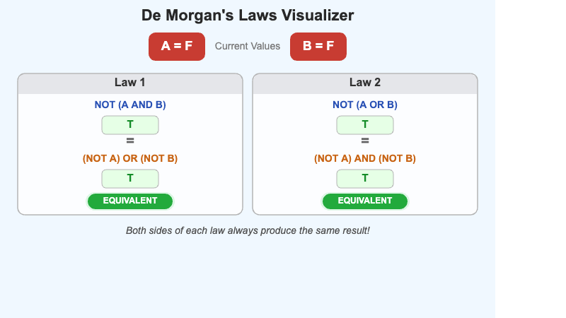

    Explore how NOT distributes over AND and OR with De Morgan's Laws.

## Chapter 4: Control Flow

-   **[Control Flow Patterns](./control-flow-patterns/index.md)**

    

    Explore the three fundamental control flow patterns: sequence, selection, and iteration.

-   **[If-Elif-Else Flowchart](./if-elif-else-flowchart/index.md)**

    

    Visualize how Python evaluates chained if-elif-else conditions as a flowchart.

-   **[Range Function Explorer](./range-function-explorer/index.md)**

    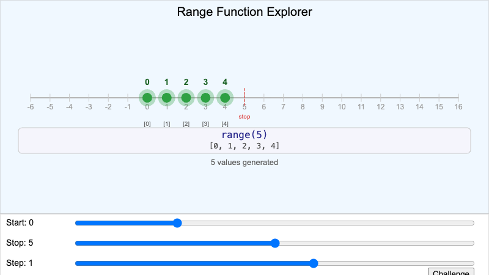

    Experiment with Python's range() function and see the sequence of numbers it generates.

-   **[Break vs Continue Visualizer](./break-vs-continue/index.md)**

    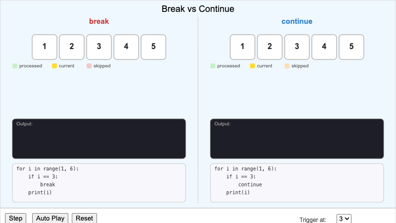

    See how break and continue alter the flow of a loop with step-by-step animation.

-   **[Nested Loop Grid Visualizer](./nested-loop-grid/index.md)**

    

    Watch nested loops fill a grid cell by cell to understand inner and outer loop behavior.

-   **[Loop Patterns Comparison](./loop-patterns-comparison/index.md)**

    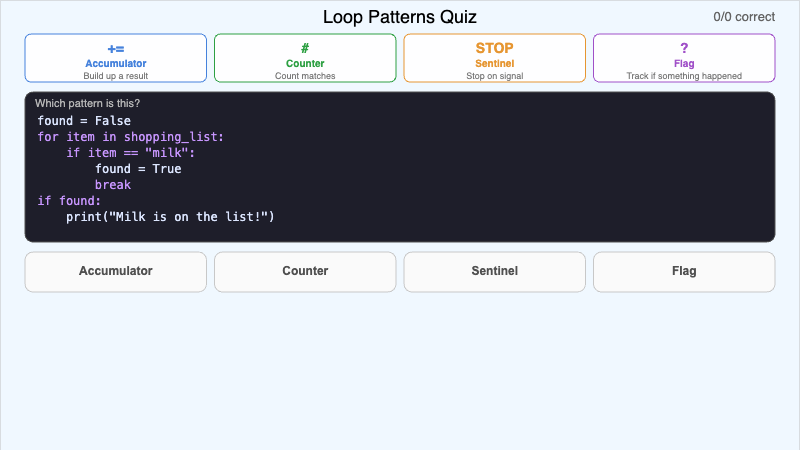

    Compare for loops, while loops, and other iteration patterns side by side.

## Chapter 5: Working with Strings

-   **[String Indexing Visualizer](./string-indexing-visualizer/index.md)**

    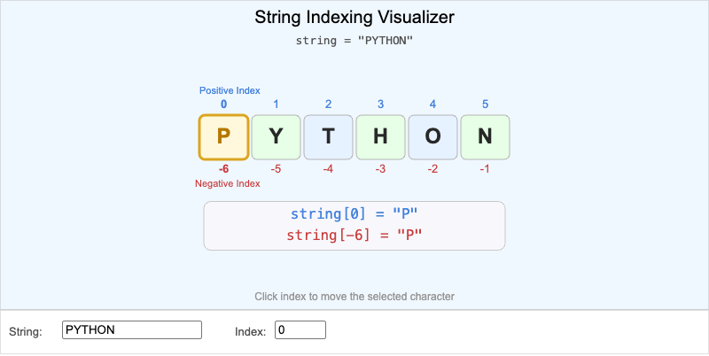

    See how Python accesses individual characters in a string using positive and negative indices.

-   **[String Slicing Playground](./string-slicing-playground/index.md)**

    

    Type slice expressions and see which characters are selected with visual highlighting.

-   **[Split and Join Visualizer](./split-join-visualizer/index.md)**

    

    Watch how split() breaks strings into lists and join() reassembles them.

-   **[String Formatting Comparison](./string-formatting-comparison/index.md)**

    

    Compare f-strings, format(), and % formatting approaches side by side.

-   **[Palindrome Checker](./palindrome-checker/index.md)**

    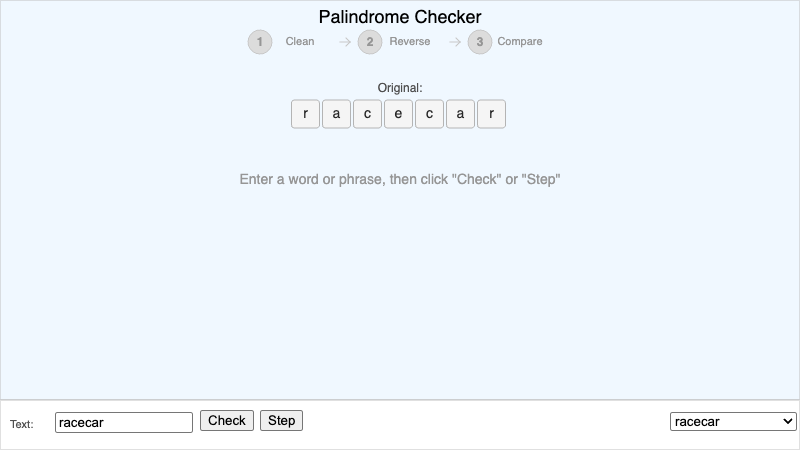

    Type a word or phrase and see step-by-step how Python checks if it's a palindrome.

-   **[String Methods Explorer](./string-methods-explorer/index.md)**

    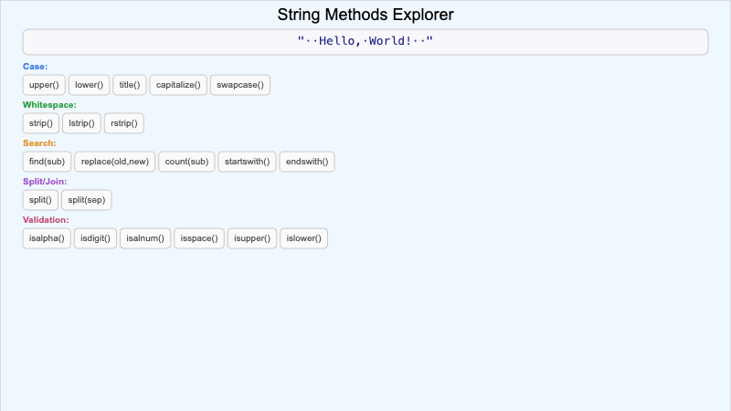

    Try out common string methods and see how they transform text in real time.

## Chapter 6: Functions and Modular Design

-   **[Function Anatomy](./function-anatomy/index.md)**

    

    Explore the parts of a Python function: def keyword, name, parameters, body, and return value.

-   **[Function Call Flow](./function-call-flow/index.md)**

    

    Trace how Python executes function calls, passes arguments, and returns values.

-   **[Arguments vs Parameters](./args-vs-params/index.md)**

    

    Understand the difference between parameters (in definitions) and arguments (in calls).

-   **[Variable Scope Visualizer](./variable-scope-visualizer/index.md)**

    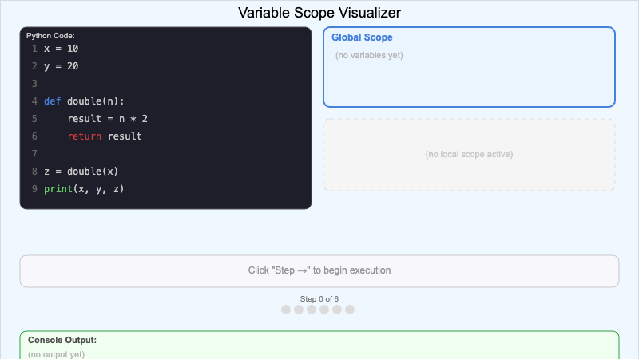

    See how local and global variable scopes work when functions are called.

-   **[Modular Design Builder](./modular-design-builder/index.md)**

    

    Build a program from small, reusable functions to see the power of modular design.

-   **[Function Pattern Gallery](./function-pattern-gallery/index.md)**

    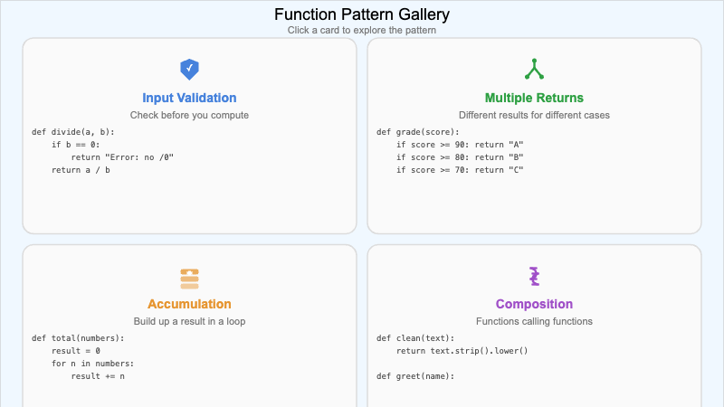

    Browse common function patterns: pure functions, predicates, accumulators, and more.

## Chapter 7: Higher-Order Functions and Recursion

-   **[Higher-Order Functions Flow](./higher-order-functions-flow/index.md)**

    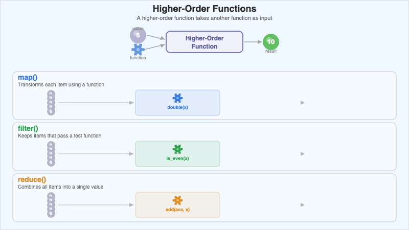

    Visualize how functions can accept other functions as arguments and return them.

-   **[Map-Filter-Reduce Pipeline](./map-filter-reduce-pipeline/index.md)**

    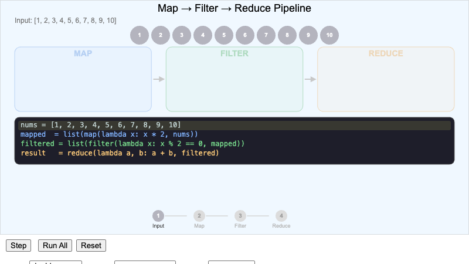

    Watch data flow through map, filter, and reduce transformations step by step.

-   **[Factorial Recursion Tree](./factorial-recursion-tree/index.md)**

    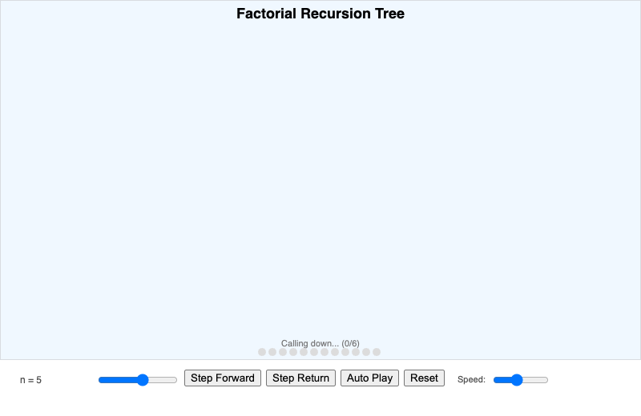

    See how recursive calls build a tree of factorial computations that unwind to produce the answer.

-   **[Recursive Call Stack Visualizer](./recursive-call-stack/index.md)**

    

    Watch stack frames push and pop as a recursive function executes.

-   **[Fibonacci Tree Visualization](./fibonacci-tree/index.md)**

    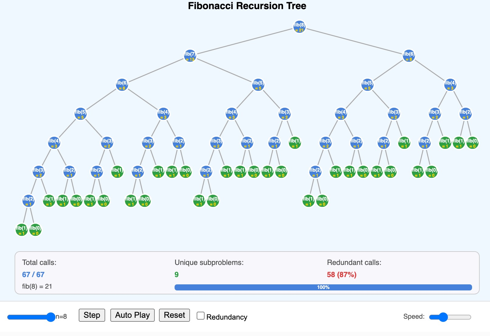

    Explore the branching tree of recursive Fibonacci calls and see why it grows exponentially.

-   **[Recursion vs Iteration Side-by-Side](./recursion-vs-iteration/index.md)**

    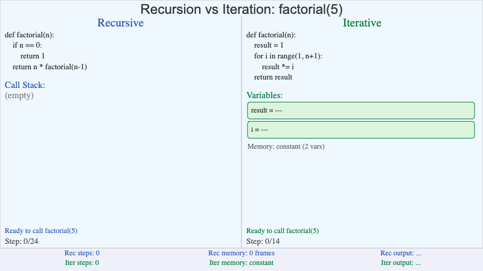

    Compare recursive and iterative solutions to the same problem running in parallel.

## Chapter 8: Lists

-   **[List Creation Visualizer](./list-creation-visualizer/index.md)**

    

    Type comma-separated values and see them stored as indexed boxes in a Python list.

-   **[List Indexing & Slicing Explorer](./list-index-slice-explorer/index.md)**

    

    Type index or slice expressions and see which list items are selected with visual highlighting.

-   **[List Methods Playground](./list-methods-playground/index.md)**

    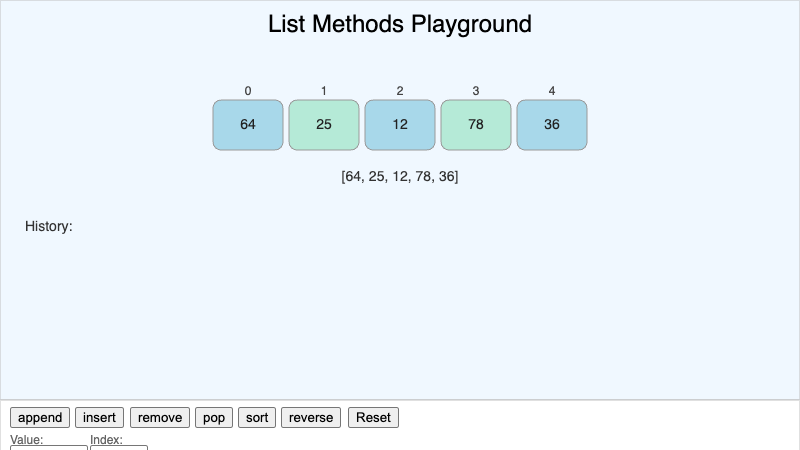

    Experiment with append, insert, remove, pop, sort, and reverse on a visual list.

-   **[Nested List Grid Visualizer](./nested-list-grid/index.md)**

    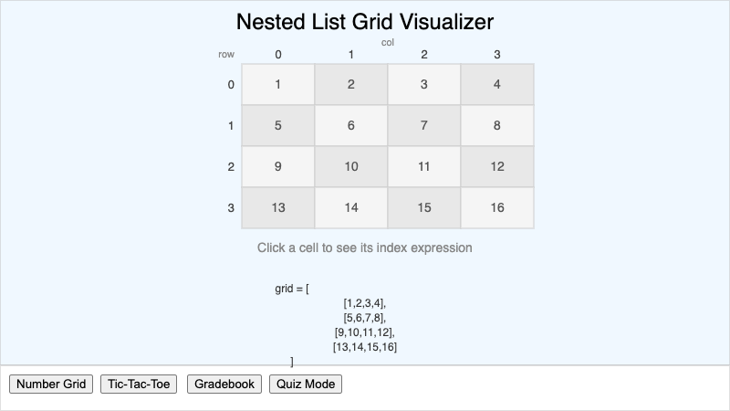

    Click cells in a grid to see double-index notation for accessing nested list elements.

-   **[List Traversal Animator](./list-traversal-animator/index.md)**

    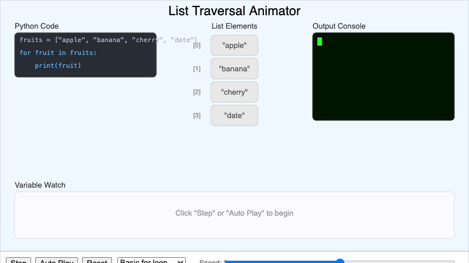

    Step through a for loop and watch the pointer move through each list element.

-   **[Zip Function Visualizer](./zip-function-visualizer/index.md)**

    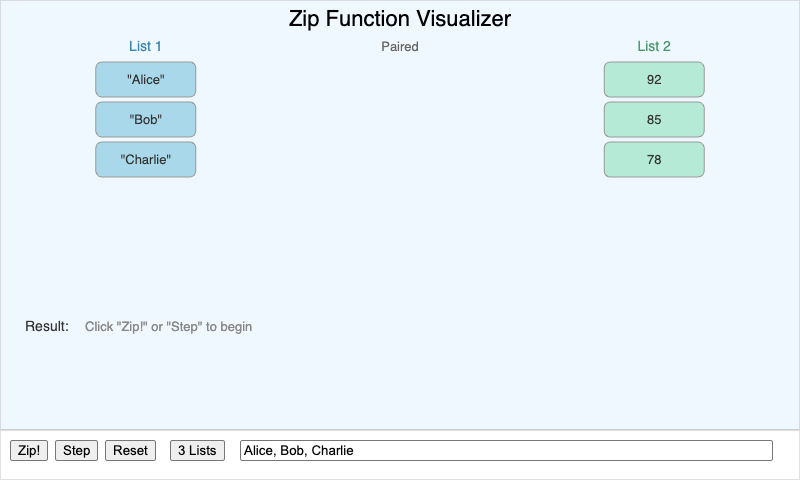

    Watch zip() pair elements from multiple lists together with an animated zipper metaphor.

## Other

-   **[Class vs. Object Visual](./class-vs-object-diagram/index.md)**

    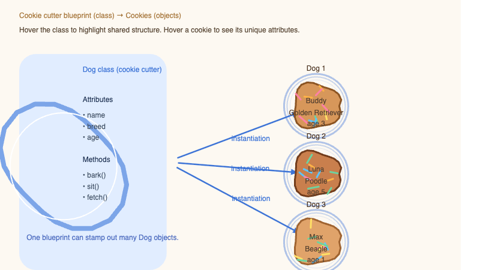

    See the difference between a class blueprint and the objects created from it.

