# MicroSims

Interactive simulations that let you explore computer science concepts
by experimenting in real time. Click any card to launch the MicroSim.

**Total MicroSims:** 84 | **Chapters covered:** 15

## Chapter 1: Intro to Computer Science

-   **[Computational Thinking Pillars](./computational-thinking-pillars/index.md)**

    

    Visualize the four pillars of computational thinking: decomposition, pattern recognition, abstraction, and algorithms.

-   **[Inside a Computer](./inside-a-computer/index.md)**

    

    Explore the internal components of a computer and how they work together.

-   **[Binary Number Explorer](./binary-number-explorer/index.md)**

    

    Convert between binary and decimal and see how computers represent numbers.

-   **[ASCII Character Map](./ascii-character-map/index.md)**

    

    Discover how characters are encoded as numbers using the ASCII standard.

-   **[Symbol Character Quiz](./symbol-character-quiz/index.md)**

    

    Test your knowledge of ASCII symbol characters by identifying them by name.

-   **[Python vs Java Language Trends](./cs-lang-trends/index.md)**

    

    Compare the popularity of Python and Java from 2010 to 2025 in an interactive line chart.

-   **[Compiled vs. Interpreted Languages](./compiled-vs-interpreted/index.md)**

    

    Compare how compiled and interpreted languages turn source code into running programs.

## Chapter 2: Python Fundamentals

-   **[Python REPL vs. Scripts](./repl-vs-scripts/index.md)**

    

    Compare interactive REPL mode with running saved Python scripts.

-   **[Python Data Types Overview](./python-data-types/index.md)**

    

    Explore Python's built-in data types and how they behave.

-   **[Arithmetic Operators Explorer](./arithmetic-operators/index.md)**

    

    Try out Python's arithmetic operators and see results update live.

-   **[String Operations Playground](./string-operations/index.md)**

    

    Experiment with slicing, concatenation, and other string operations.

-   **[Expressions vs. Statements](./expressions-vs-statements/index.md)**

    

    Learn the difference between expressions that produce values and statements that perform actions.

-   **[Code Readability Comparison](./code-readability/index.md)**

    

    See how formatting and naming choices affect how easy code is to read.

## Chapter 3: Boolean Logic

-   **[Comparison Operator Explorer](./comparison-operator-explorer/index.md)**

    

    Test comparison operators and see how Python evaluates them to True or False.

-   **[Logical Operator Venn Diagrams](./logical-operator-venn/index.md)**

    

    Visualize AND, OR, and NOT using interactive Venn diagrams.

-   **[Interactive Truth Table Builder](./truth-table-builder/index.md)**

    

    Build truth tables for Boolean expressions and check your understanding.

-   **[Truthiness Tester](./truthiness-tester/index.md)**

    

    Find out which Python values are "truthy" and which are "falsy."

-   **[Order of Operations Visualizer](./boolean-order-of-ops/index.md)**

    

    See how Python evaluates Boolean expressions step by step.

-   **[De Morgan's Laws Visualizer](./demorgans-laws/index.md)**

    

    Explore how NOT distributes over AND and OR with De Morgan's Laws.

## Chapter 4: Control Flow

-   **[Control Flow Patterns](./control-flow-patterns/index.md)**

    

    Explore the three fundamental control flow patterns: sequence, selection, and iteration.

-   **[If-Elif-Else Flowchart](./if-elif-else-flowchart/index.md)**

    

    Visualize how Python evaluates chained if-elif-else conditions as a flowchart.

-   **[Range Function Explorer](./range-function-explorer/index.md)**

    

    Experiment with Python's range() function and see the sequence of numbers it generates.

-   **[Break vs Continue Visualizer](./break-vs-continue/index.md)**

    

    See how break and continue alter the flow of a loop with step-by-step animation.

-   **[Nested Loop Grid Visualizer](./nested-loop-grid/index.md)**

    

    Watch nested loops fill a grid cell by cell to understand inner and outer loop behavior.

-   **[Loop Patterns Comparison](./loop-patterns-comparison/index.md)**

    

    Compare for loops, while loops, and other iteration patterns side by side.

## Chapter 5: Working with Strings

-   **[String Indexing Visualizer](./string-indexing-visualizer/index.md)**

    

    See how Python accesses individual characters in a string using positive and negative indices.

-   **[String Slicing Playground](./string-slicing-playground/index.md)**

    

    Type slice expressions and see which characters are selected with visual highlighting.

-   **[Split and Join Visualizer](./split-join-visualizer/index.md)**

    

    Watch how split() breaks strings into lists and join() reassembles them.

-   **[String Formatting Comparison](./string-formatting-comparison/index.md)**

    

    Compare f-strings, format(), and % formatting approaches side by side.

-   **[Palindrome Checker](./palindrome-checker/index.md)**

    

    Type a word or phrase and see step-by-step how Python checks if it's a palindrome.

-   **[String Methods Explorer](./string-methods-explorer/index.md)**

    

    Try out common string methods and see how they transform text in real time.

## Chapter 6: Functions and Modular Design

-   **[Function Anatomy](./function-anatomy/index.md)**

    

    Explore the parts of a Python function: def keyword, name, parameters, body, and return value.

-   **[Function Call Flow](./function-call-flow/index.md)**

    

    Trace how Python executes function calls, passes arguments, and returns values.

-   **[Arguments vs Parameters](./args-vs-params/index.md)**

    

    Understand the difference between parameters (in definitions) and arguments (in calls).

-   **[Variable Scope Visualizer](./variable-scope-visualizer/index.md)**

    

    See how local and global variable scopes work when functions are called.

-   **[Modular Design Builder](./modular-design-builder/index.md)**

    

    Build a program from small, reusable functions to see the power of modular design.

-   **[Function Pattern Gallery](./function-pattern-gallery/index.md)**

    

    Browse common function patterns: pure functions, predicates, accumulators, and more.

## Chapter 7: Higher-Order Functions and Recursion

-   **[Higher-Order Functions Flow](./higher-order-functions-flow/index.md)**

    

    Visualize how functions can accept other functions as arguments and return them.

-   **[Map-Filter-Reduce Pipeline](./map-filter-reduce-pipeline/index.md)**

    

    Watch data flow through map, filter, and reduce transformations step by step.

-   **[Factorial Recursion Tree](./factorial-recursion-tree/index.md)**

    

    See how recursive calls build a tree of factorial computations that unwind to produce the answer.

-   **[Recursive Call Stack Visualizer](./recursive-call-stack/index.md)**

    

    Watch stack frames push and pop as a recursive function executes.

-   **[Fibonacci Tree Visualization](./fibonacci-tree/index.md)**

    

    Explore the branching tree of recursive Fibonacci calls and see why it grows exponentially.

-   **[Recursion vs Iteration Side-by-Side](./recursion-vs-iteration/index.md)**

    

    Compare recursive and iterative solutions to the same problem running in parallel.

## Chapter 8: Lists

-   **[List Creation Visualizer](./list-creation-visualizer/index.md)**

    

    Type comma-separated values and see them stored as indexed boxes in a Python list.

-   **[List Indexing & Slicing Explorer](./list-index-slice-explorer/index.md)**

    

    Type index or slice expressions and see which list items are selected with visual highlighting.

-   **[List Methods Playground](./list-methods-playground/index.md)**

    

    Experiment with append, insert, remove, pop, sort, and reverse on a visual list.

-   **[Nested List Grid Visualizer](./nested-list-grid/index.md)**

    

    Click cells in a grid to see double-index notation for accessing nested list elements.

-   **[List Traversal Animator](./list-traversal-animator/index.md)**

    

    Step through a for loop and watch the pointer move through each list element.

-   **[Zip Function Visualizer](./zip-function-visualizer/index.md)**

    

    Watch zip() pair elements from multiple lists together with an animated zipper metaphor.

## Chapter 9: Advanced List Operations

-   **[List Aliasing Visualizer](./list-aliasing-visualizer/index.md)**

    

    See how variable names map to list objects in memory and discover the difference between aliases and copies.

-   **[Shallow vs Deep Copy Visualizer](./shallow-vs-deep-copy/index.md)**

    

    Compare shallow and deep copies side by side and see how changes to nested elements propagate differently.

-   **[List Statistics Dashboard](./list-statistics-dashboard/index.md)**

    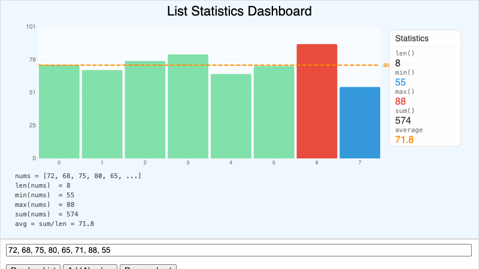

    Enter or generate a list of numbers and see len, min, max, sum, and average update in real time with a bar chart.

-   **[Stack Simulator](./stack-simulator/index.md)**

    

    Push and pop items on an interactive stack to experience LIFO (Last In, First Out) behavior.

-   **[Queue Simulator](./queue-simulator/index.md)**

    

    Enqueue and dequeue items to experience FIFO (First In, First Out) behavior, with a compare mode against a stack.

-   **[List Operations Cheat Sheet](./list-operations-cheat-sheet/index.md)**

    

    Interactive reference for all advanced list operations organized by category with a Quiz Me mode.

## Chapter 10: Tuples and Sets

-   **[Tuple vs List Mutability](./tuple-vs-list-mutability/index.md)**

    

    Compare mutable list and immutable tuple behavior through interactive button operations.

-   **[Tuples vs Lists Decision Helper](./tuples-vs-lists/index.md)**

    

    Choose between tuples and lists for real-world coding scenarios with explanatory feedback.

-   **[Set Operations with Venn Diagrams](./venn-diagram-sets/index.md)**

    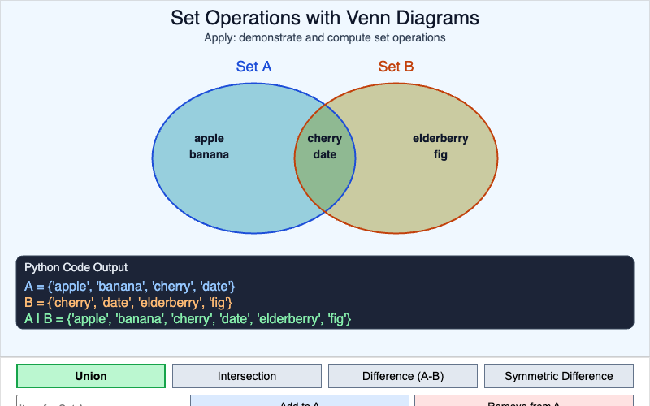

    Visualize union, intersection, difference, and symmetric difference with interactive Venn diagram regions.

-   **[Removing Duplicates with a Set](./removing-duplicates/index.md)**

    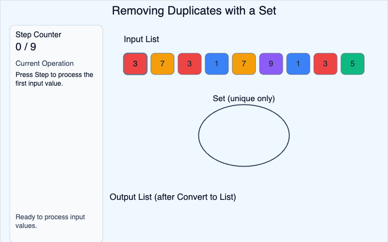

    Watch list values move into a set container, rejecting duplicates and converting back to a unique list.

-   **[Tuple and Set Concept Map](./tuple-set-concept-map/index.md)**

    

    Explore relationships between lists, tuples, sets, and frozensets through interactive concept nodes.

## Chapter 12: Classes and Objects

-   **[Class vs. Object Visual](./class-vs-object-diagram/index.md)**

    

    Compare a class blueprint (cookie cutter) to multiple object instances (decorated cookies).

-   **[Instance vs. Class Attributes](./instance-vs-class-attributes/index.md)**

    

    Demonstrate the difference between attributes shared by a class and those unique to each instance.

-   **[Dog Class UML Diagram](./dog-class-uml-diagram/index.md)**

    

    Display the complete UML structure of a Dog class with attributes and methods.

-   **[Encapsulation Bank Vault](./encapsulation-bank-vault/index.md)**

    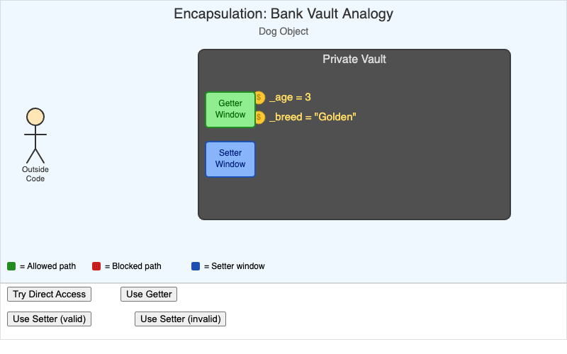

    Use a bank vault metaphor to explain encapsulation and data protection in OOP.

-   **[Dog Class Playground](./dog-class-playground/index.md)**

    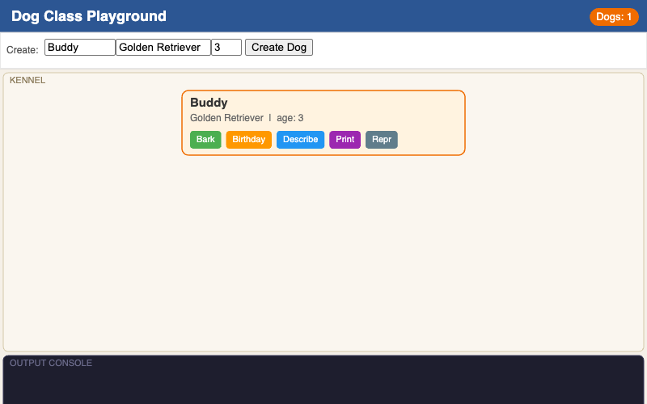

    Create Dog objects, call methods, and observe output in an interactive console.

-   **[OOP Benefits Concept Map](./oop-benefits-concept-map/index.md)**

    

    Explore five key benefits of Object-Oriented Programming through interactive concept nodes.

## Chapter 13: Inheritance and Polymorphism

-   **[Animal Class Hierarchy](./animal-class-hierarchy/index.md)**

    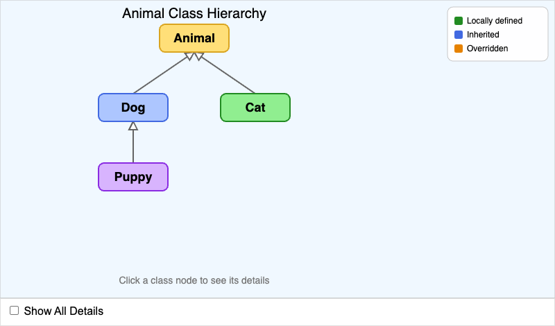

    Show inheritance relationships between parent and child animal classes.

-   **[Shape Hierarchy with Abstract Base Class](./shape-abstract-hierarchy/index.md)**

    

    Demonstrate abstract base classes and inheritance in a shape hierarchy.

-   **[Dunder Methods Cheat Sheet](./dunder-methods-cheatsheet/index.md)**

    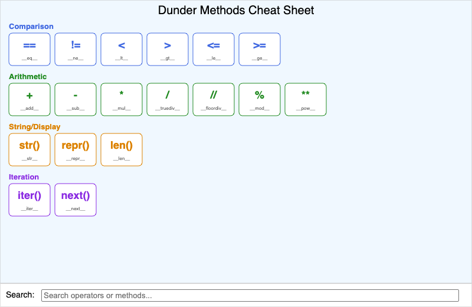

    Reference guide for Python's special double-underscore methods.

-   **[UML Class Diagram Builder](./uml-class-diagram-builder/index.md)**

    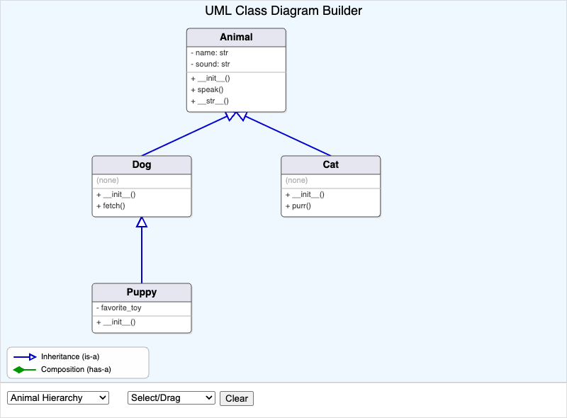

    Interactively build and explore UML class diagrams.

-   **[Music Library Class Diagram](./music-library-diagram/index.md)**

    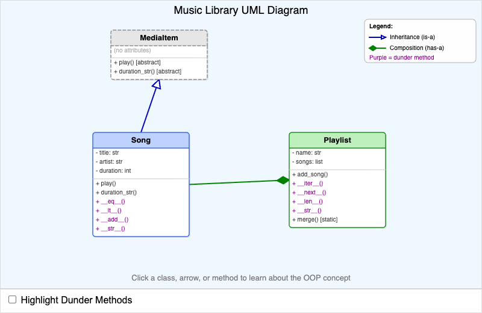

    Model a music library system with class relationships and structure.

-   **[Polymorphism Playground](./polymorphism-playground/index.md)**

    

    Explore polymorphism through interactive demonstrations of method overriding.

## Chapter 14: Errors and Exceptions

-   **[Error Type Identifier](./error-type-identifier/index.md)**

    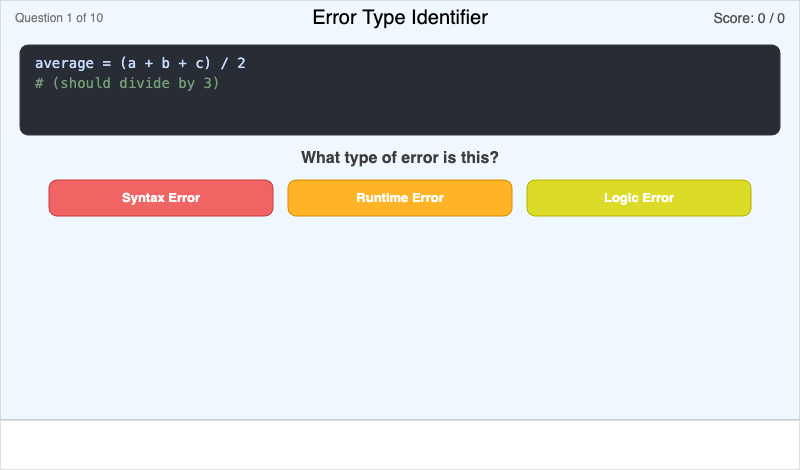

    Identify and classify different Python error types from code examples.

-   **[Three Types of Errors](./error-types-comparison/index.md)**

    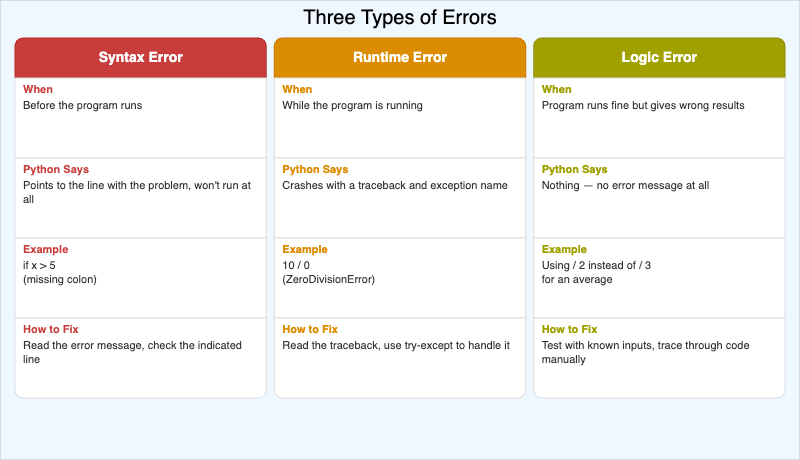

    Compare syntax errors, runtime errors, and logic errors with examples.

-   **[Python Exception Hierarchy](./exception-hierarchy/index.md)**

    

    Visualize the inheritance tree of Python exception classes.

-   **[Try-Except Block Builder](./try-except-builder/index.md)**

    

    Construct and understand try-except error handling blocks interactively.

-   **[Try-Except-Finally Flow Chart](./try-except-flow/index.md)**

    

    Trace execution flow through try, except, and finally blocks.

-   **[Exception Handling Simulator](./exception-handling-sim/index.md)**

    

    Simulate exception handling scenarios and predict their outcomes.

## Chapter 15: File Input and Output

-   **[File I/O Flow](./file-io-flow/index.md)**

    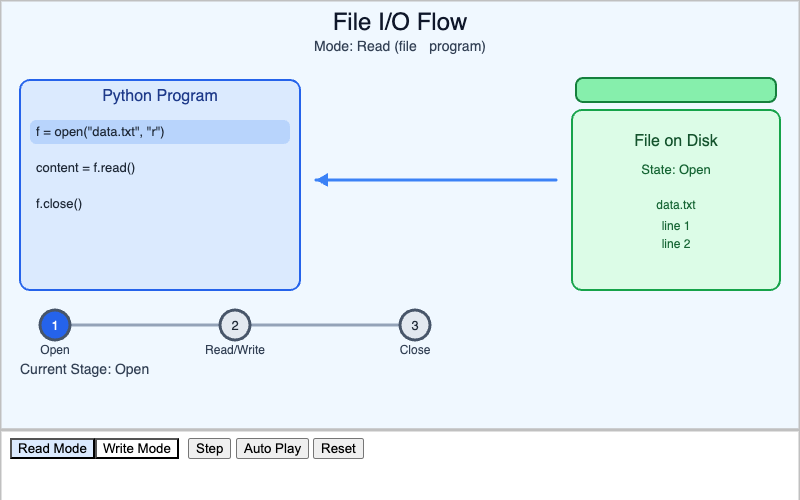

    Visualize the flow of file input/output operations.

-   **[Read Methods Comparison](./read-methods-comparison/index.md)**

    

    Compare different file reading methods and their effects.

-   **[With Statement vs Manual Close](./with-vs-manual/index.md)**

    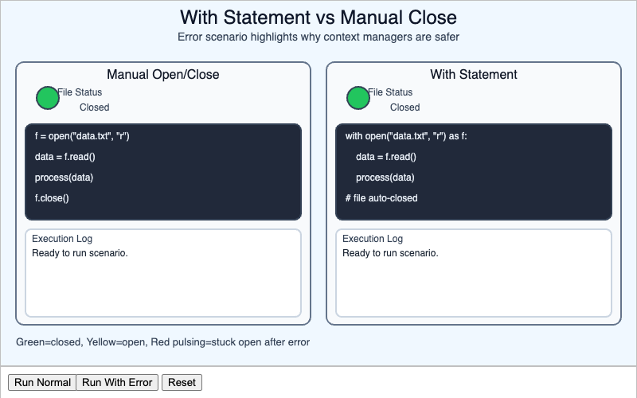

    Show the difference between context managers and manual file closing.

-   **[CSV File Structure](./csv-file-structure/index.md)**

    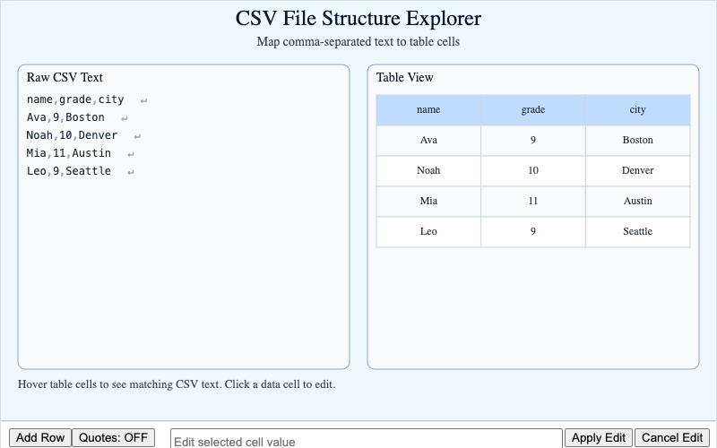

    Understand how CSV files organize data in rows and columns.

-   **[JSON to Dictionary Mapping](./json-dict-mapping/index.md)**

    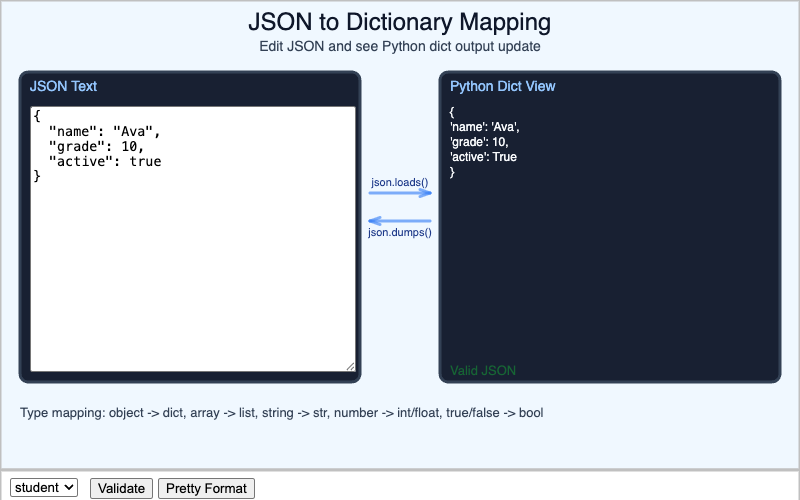

    See how JSON data maps to Python dictionaries.

-   **[File Format Decision Tree](./file-format-decision/index.md)**

    

    Choose appropriate file formats based on data characteristics.

## Chapter 16: Software Engineering

-   **[Software Development Lifecycle](./software-development-lifecycle/index.md)**

    

    Trace the phases of software development from conception to deployment.

-   **[Module and Package Structure](./module-and-package-structure/index.md)**

    

    Explore how Python modules and packages are organized.

-   **[Git Workflow Visualizer](./git-workflow-visualizer/index.md)**

    

    Visualize Git operations and version control workflow.

-   **[DRY vs. WET Code Comparison](./dry-vs-wet-code-comparison/index.md)**

    

    Compare Don't Repeat Yourself principles with code repetition examples.

-   **[Comment Quality Checker](./comment-quality-checker/index.md)**

    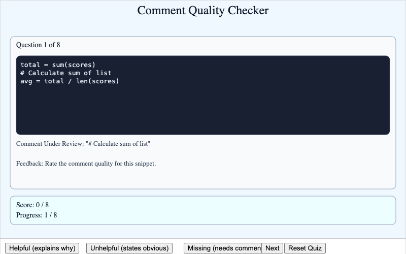

    Evaluate and improve code comment quality.

-   **[Name Equals Main Simulator](./name-equals-main-simulator/index.md)**

    

    Demonstrate the purpose and behavior of the if \_\_name\_\_ == '\_\_main\_\_' pattern.

## Chapter 17: Testing and Debugging

-   **[Unit Test Runner](./unit-test-runner/index.md)**

    

    Run and visualize unit test execution and results.

-   **[Boundary Testing Playground](./boundary-testing/index.md)**

    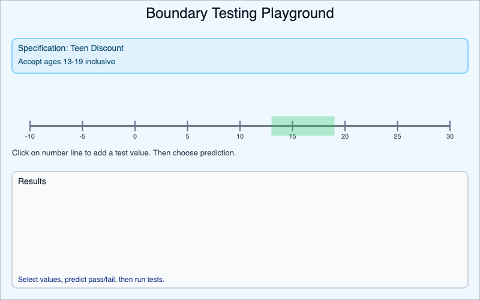

    Test edge cases and boundary conditions in software.

-   **[TDD Cycle](./tdd-cycle/index.md)**

    

    Walk through the Test-Driven Development cycle of red-green-refactor.

-   **[Visual Debugger Simulator](./visual-debugger/index.md)**

    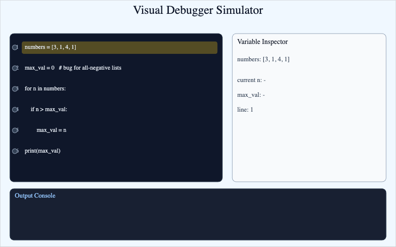

    Step through code execution with visual variable state tracking.

-   **[Debugging Strategy Flowchart](./debugging-flowchart/index.md)**

    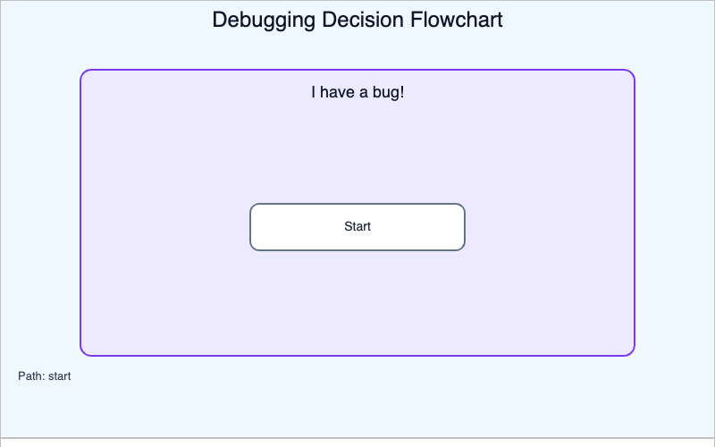

    Decision flowchart to select appropriate debugging strategies.

-   **[Input Validation Tester](./input-validation-tester/index.md)**

    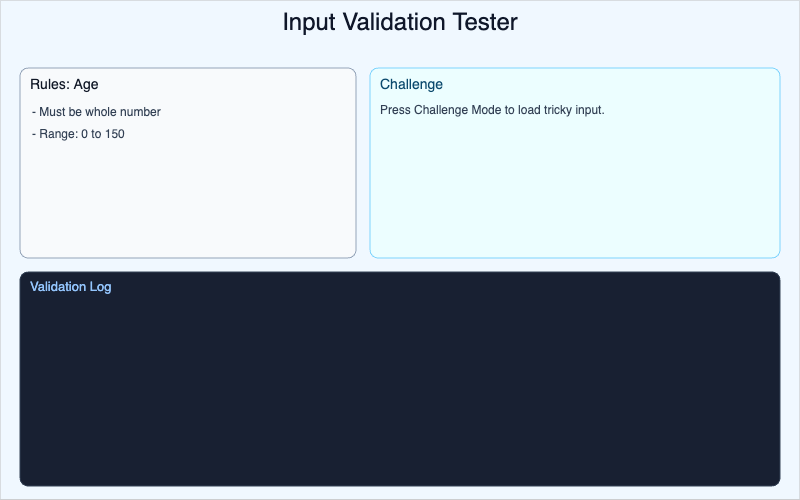

    Test input validation logic and error handling.

## Chapter 20: Advanced Python

-   **[Generator vs List Memory](./generator-vs-list-memory/index.md)**

    

    Compare eager list allocation with lazy generator evaluation through side-by-side memory usage visuals.

-   **[How Decorators Work](./decorator-flow/index.md)**

    

    Step through how a decorator receives a function, creates a wrapper, and intercepts calls.

-   **[Regex Pattern Tester](./regex-pattern-tester/index.md)**

    

    Enter regex patterns and test text with real-time match highlighting and example presets.

-   **[Collections Module Overview](./collections-overview/index.md)**

    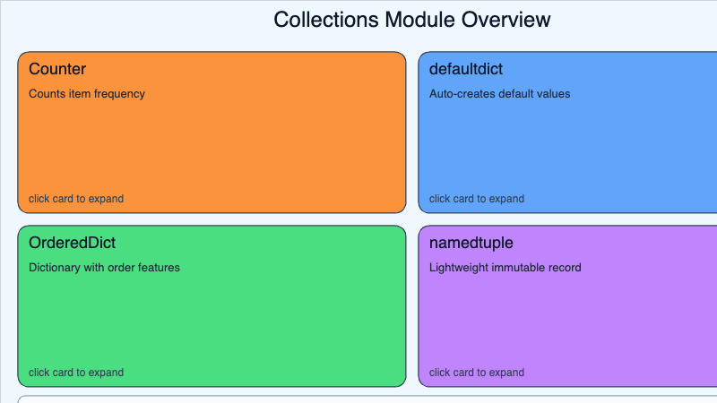

    Explore `Counter`, `defaultdict`, `OrderedDict`, and `namedtuple` with expandable cards and quiz mode.

-   **[Context Manager Flow](./context-manager-flow/index.md)**

    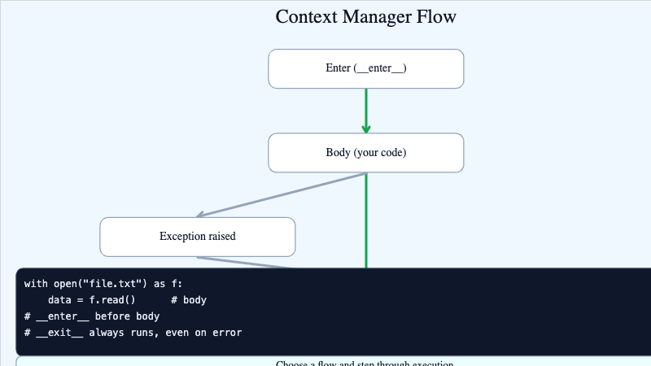

    Trace normal and exception paths in a `with` statement to see why cleanup always runs.

-   **[Python Best Practices Checklist](./python-best-practices/index.md)**

    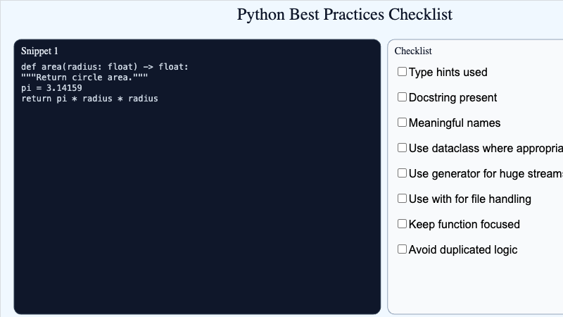

    Evaluate code snippets against a best-practices checklist and score your assessments.

